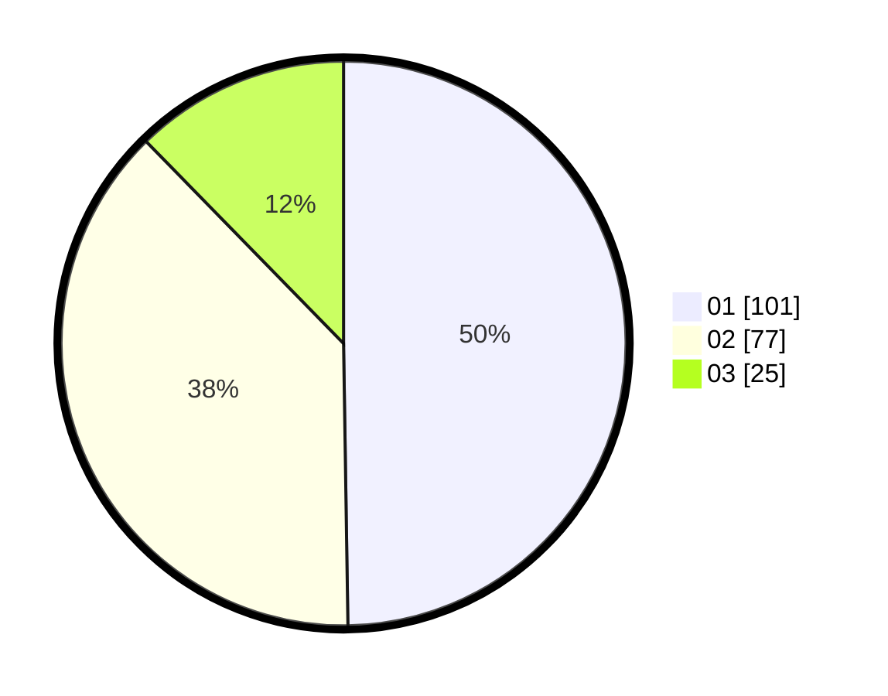

# Hasil

Hasil perolehan suara paslon dapat dilihat pada file paslon-01.txt, paslon-02.txt, dan paslon-03.txt.

Jika tidak ada, artinya data tersebut belum ada pada SIREKAP.

## Perolehan Suara

 * Paslon 01: **101**.
 * Paslon 02: **77**.
 * Paslon 03: **25**.

## Foto C Plano

https://sirekap-obj-formc.kpu.go.id/2464/pemilu/ppwp/31/74/06/10/03/3174061003045-20240215-035539--3bef9613-955c-4104-9799-f24b8be40834.jpg

https://sirekap-obj-formc.kpu.go.id/2464/pemilu/ppwp/31/74/06/10/03/3174061003045-20240215-035544--caa2ebdc-7b02-41cf-be2b-3e9ff12a44d5.jpg

https://sirekap-obj-formc.kpu.go.id/2464/pemilu/ppwp/31/74/06/10/03/3174061003045-20240215-035547--1bd56060-30cf-4b09-8842-b38739fb9083.jpg

## DATA PEMILIH TETAP

Jumlah pemilih dalam DPT: **273**.
 * L: **145**.
 * P: **128**.

## DATA PENGGUNA HAK PILIH

Jumlah pengguna hak pilih dalam DPT: **203**.
 * L: **106**.
 * P: **97**.

Jumlah pengguna hak pilih dalam DPTb: **0**.
 * L: **0**.
 * P: **0**.

Jumlah pengguna hak pilih dalam DPK: **3**.
 * L: **2**.
 * P: **1**.

Jumlah pengguna hak pilih: **206**.
 * L: **108**.
 * P: **98**.

## JUMLAH SUARA SAH DAN TIDAK SAH

JUMLAH SELURUH SUARA SAH: **203**.

JUMLAH SUARA TIDAK SAH: **3**.

JUMLAH SELURUH SUARA SAH DAN SUARA TIDAK SAH: **206**.
