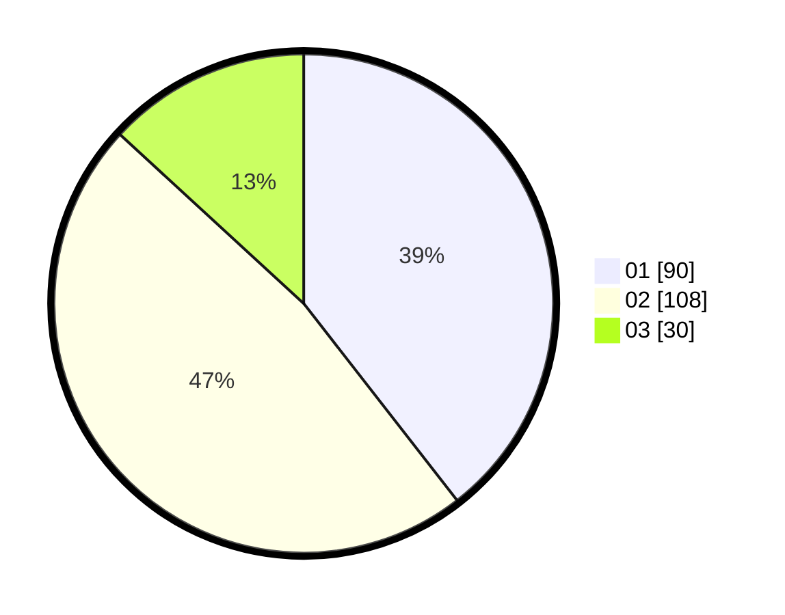

# Hasil

Hasil perolehan suara paslon dapat dilihat pada file paslon-01.txt, paslon-02.txt, dan paslon-03.txt.

Jika tidak ada, artinya data tersebut belum ada pada SIREKAP.

## Perolehan Suara

 * Paslon 01: **90**.
 * Paslon 02: **108**.
 * Paslon 03: **30**.

## Foto C Plano

https://sirekap-obj-formc.kpu.go.id/b76f/pemilu/ppwp/31/74/06/10/03/3174061003065-20240214-191258--e6e124b5-c42a-4366-ae28-4f5d30808a52.jpg

https://sirekap-obj-formc.kpu.go.id/b76f/pemilu/ppwp/31/74/06/10/03/3174061003065-20240214-191452--bf0a828f-68b8-4ac3-ac54-9f8e39ad20bf.jpg

https://sirekap-obj-formc.kpu.go.id/b76f/pemilu/ppwp/31/74/06/10/03/3174061003065-20240214-191616--0da1ef50-aadd-4075-aa0d-14041c4ae017.jpg

## DATA PEMILIH TETAP

Jumlah pemilih dalam DPT: **285**.
 * L: **131**.
 * P: **154**.

## DATA PENGGUNA HAK PILIH

Jumlah pengguna hak pilih dalam DPT: **230**.
 * L: **99**.
 * P: **131**.

Jumlah pengguna hak pilih dalam DPTb: **0**.
 * L: **0**.
 * P: **0**.

Jumlah pengguna hak pilih dalam DPK: **0**.
 * L: **0**.
 * P: **0**.

Jumlah pengguna hak pilih: **230**.
 * L: **99**.
 * P: **131**.

## JUMLAH SUARA SAH DAN TIDAK SAH

JUMLAH SELURUH SUARA SAH: **228**.

JUMLAH SUARA TIDAK SAH: **2**.

JUMLAH SELURUH SUARA SAH DAN SUARA TIDAK SAH: **230**.
