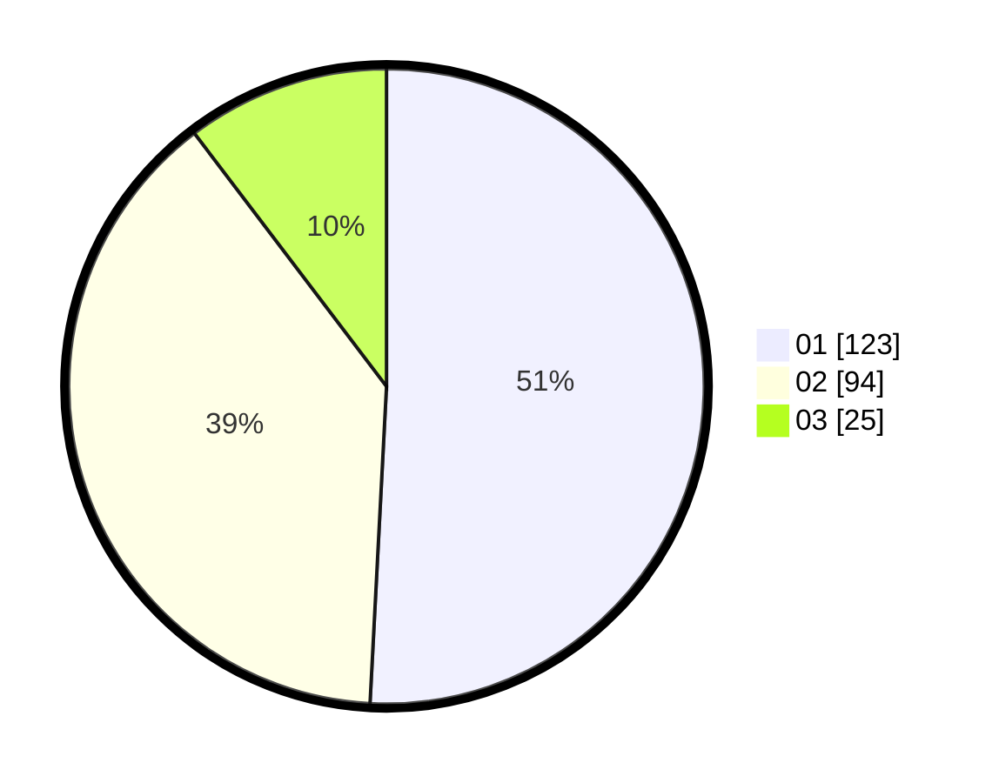

# Hasil

Hasil perolehan suara paslon dapat dilihat pada file paslon-01.txt, paslon-02.txt, dan paslon-03.txt.

Jika tidak ada, artinya data tersebut belum ada pada SIREKAP.

## Perolehan Suara

 * Paslon 01: **123**.
 * Paslon 02: **94**.
 * Paslon 03: **25**.

## Foto C Plano

https://sirekap-obj-formc.kpu.go.id/d22e/pemilu/ppwp/31/74/06/10/03/3174061003066-20240215-021542--c9e52bfb-578f-47ce-b6f0-1515a2501acc.jpg

https://sirekap-obj-formc.kpu.go.id/d22e/pemilu/ppwp/31/74/06/10/03/3174061003066-20240215-021640--87598335-10be-40f7-b665-3a3b6bcb86ef.jpg

https://sirekap-obj-formc.kpu.go.id/d22e/pemilu/ppwp/31/74/06/10/03/3174061003066-20240215-021730--19bcaeab-af02-44f0-bd8c-54b49d0a8d1e.jpg

## DATA PEMILIH TETAP

Jumlah pemilih dalam DPT: **282**.
 * L: **143**.
 * P: **134**.

## DATA PENGGUNA HAK PILIH

Jumlah pengguna hak pilih dalam DPT: **239**.
 * L: **119**.
 * P: **120**.

Jumlah pengguna hak pilih dalam DPTb: **3**.
 * L: **2**.
 * P: **1**.

Jumlah pengguna hak pilih dalam DPK: **2**.
 * L: **1**.
 * P: **1**.

Jumlah pengguna hak pilih: **244**.
 * L: **122**.
 * P: **122**.

## JUMLAH SUARA SAH DAN TIDAK SAH

JUMLAH SELURUH SUARA SAH: **242**.

JUMLAH SUARA TIDAK SAH: **2**.

JUMLAH SELURUH SUARA SAH DAN SUARA TIDAK SAH: **244**.
