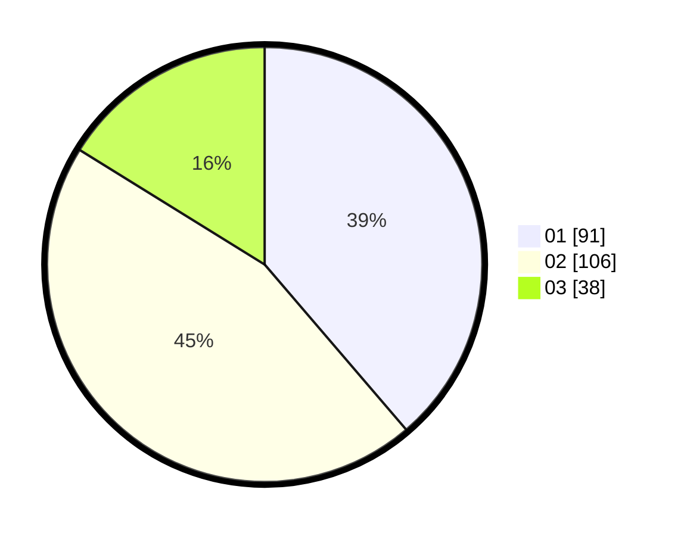

# Hasil

Hasil perolehan suara paslon dapat dilihat pada file paslon-01.txt, paslon-02.txt, dan paslon-03.txt.

Jika tidak ada, artinya data tersebut belum ada pada SIREKAP.

## Perolehan Suara

 * Paslon 01: **91**.
 * Paslon 02: **106**.
 * Paslon 03: **38**.

## Foto C Plano

https://sirekap-obj-formc.kpu.go.id/1de4/pemilu/ppwp/31/74/06/10/03/3174061003072-20240214-233155--293e7be6-de9c-4e19-a28b-0125bceaff0a.jpg

https://sirekap-obj-formc.kpu.go.id/1de4/pemilu/ppwp/31/74/06/10/03/3174061003072-20240214-233157--b89ba0ef-06f9-4c7a-9dd2-814e313a0888.jpg

https://sirekap-obj-formc.kpu.go.id/1de4/pemilu/ppwp/31/74/06/10/03/3174061003072-20240214-233203--49d2d159-cf12-482c-bebe-763327a35ee2.jpg

## DATA PEMILIH TETAP

Jumlah pemilih dalam DPT: **271**.
 * L: **131**.
 * P: **140**.

## DATA PENGGUNA HAK PILIH

Jumlah pengguna hak pilih dalam DPT: **232**.
 * L: **121**.
 * P: **111**.

Jumlah pengguna hak pilih dalam DPTb: **4**.
 * L: **2**.
 * P: **2**.

Jumlah pengguna hak pilih dalam DPK: **3**.
 * L: **2**.
 * P: **1**.

Jumlah pengguna hak pilih: **239**.
 * L: **125**.
 * P: **114**.

## JUMLAH SUARA SAH DAN TIDAK SAH

JUMLAH SELURUH SUARA SAH: **235**.

JUMLAH SUARA TIDAK SAH: **4**.

JUMLAH SELURUH SUARA SAH DAN SUARA TIDAK SAH: **239**.
