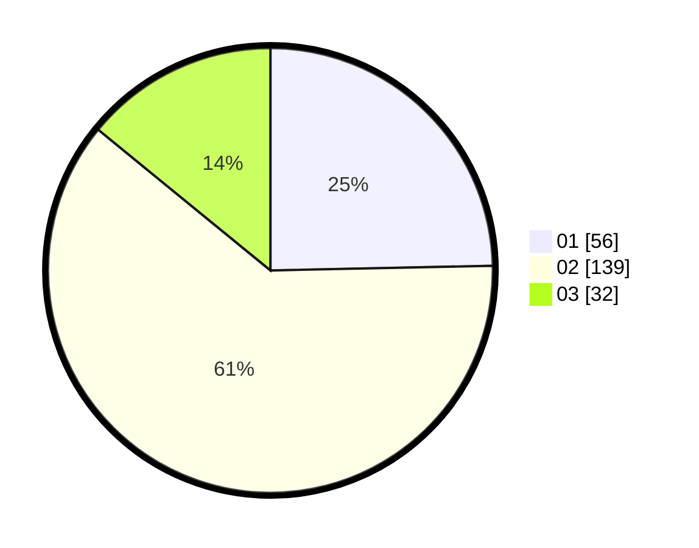

# Hasil

Hasil perolehan suara paslon dapat dilihat pada file paslon-01.txt, paslon-02.txt, dan paslon-03.txt.

Jika tidak ada, artinya data tersebut belum ada pada SIREKAP.

## Perolehan Suara

 * Paslon 01: **56**.
 * Paslon 02: **139**.
 * Paslon 03: **32**.

## Foto C Plano

https://sirekap-obj-formc.kpu.go.id/7839/pemilu/ppwp/31/74/06/10/03/3174061003084-20240216-033720--66dca158-5b36-402a-87eb-2315e57a4061.jpg

https://sirekap-obj-formc.kpu.go.id/7839/pemilu/ppwp/31/74/06/10/03/3174061003084-20240216-033721--fa3b8d0a-5d39-4a70-bc3b-130dd890ff40.jpg

https://sirekap-obj-formc.kpu.go.id/7839/pemilu/ppwp/31/74/06/10/03/3174061003084-20240216-033721--eaa52cff-f4b5-42c0-8303-294f70363d26.jpg

## DATA PEMILIH TETAP

Jumlah pemilih dalam DPT: **287**.
 * L: **143**.
 * P: **144**.

## DATA PENGGUNA HAK PILIH

Jumlah pengguna hak pilih dalam DPT: **231**.
 * L: **113**.
 * P: **118**.

Jumlah pengguna hak pilih dalam DPTb: **0**.
 * L: **0**.
 * P: **0**.

Jumlah pengguna hak pilih dalam DPK: **0**.
 * L: **0**.
 * P: **0**.

Jumlah pengguna hak pilih: **231**.
 * L: **113**.
 * P: **118**.

## JUMLAH SUARA SAH DAN TIDAK SAH

JUMLAH SELURUH SUARA SAH: **227**.

JUMLAH SUARA TIDAK SAH: **4**.

JUMLAH SELURUH SUARA SAH DAN SUARA TIDAK SAH: **231**.
