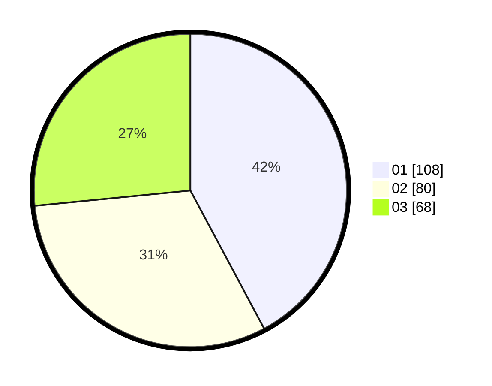

# Hasil

Hasil perolehan suara paslon dapat dilihat pada file paslon-01.txt, paslon-02.txt, dan paslon-03.txt.

Jika tidak ada, artinya data tersebut belum ada pada SIREKAP.

## Perolehan Suara

 * Paslon 01: **108**.
 * Paslon 02: **80**.
 * Paslon 03: **68**.

## Foto C Plano

https://sirekap-obj-formc.kpu.go.id/1d1f/pemilu/ppwp/31/74/06/10/03/3174061003089-20240215-150004--156196c2-84b6-4dfb-b6f9-3e3e094d66c4.jpg

https://sirekap-obj-formc.kpu.go.id/1d1f/pemilu/ppwp/31/74/06/10/03/3174061003089-20240215-150457--3de46b97-5f63-4c3c-ba9e-7a8c94043b56.jpg

https://sirekap-obj-formc.kpu.go.id/1d1f/pemilu/ppwp/31/74/06/10/03/3174061003089-20240215-150517--0bec8af6-5e47-4bcc-b4db-bfb90790e2ed.jpg

## DATA PEMILIH TETAP

Jumlah pemilih dalam DPT: **286**.
 * L: **132**.
 * P: **154**.

## DATA PENGGUNA HAK PILIH

Jumlah pengguna hak pilih dalam DPT: **246**.
 * L: **112**.
 * P: **134**.

Jumlah pengguna hak pilih dalam DPTb: **14**.
 * L: **2**.
 * P: **12**.

Jumlah pengguna hak pilih dalam DPK: **2**.
 * L: **1**.
 * P: **1**.

Jumlah pengguna hak pilih: **262**.
 * L: **115**.
 * P: **147**.

## JUMLAH SUARA SAH DAN TIDAK SAH

JUMLAH SELURUH SUARA SAH: **256**.

JUMLAH SUARA TIDAK SAH: **6**.

JUMLAH SELURUH SUARA SAH DAN SUARA TIDAK SAH: **262**.
