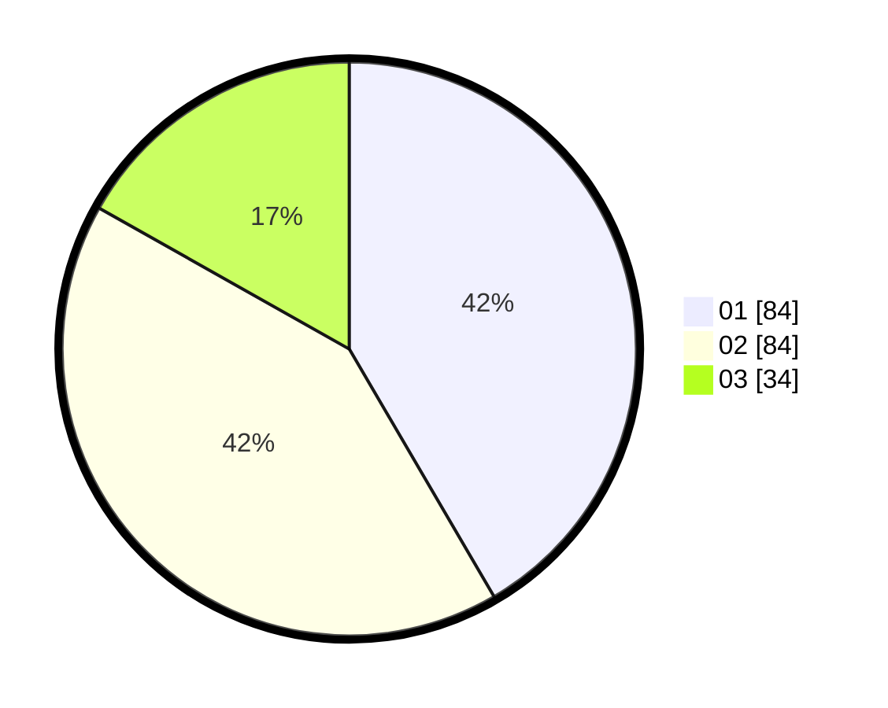

# Hasil

Hasil perolehan suara paslon dapat dilihat pada file paslon-01.txt, paslon-02.txt, dan paslon-03.txt.

Jika tidak ada, artinya data tersebut belum ada pada SIREKAP.

## Perolehan Suara

 * Paslon 01: **84**.
 * Paslon 02: **84**.
 * Paslon 03: **34**.

## Foto C Plano

https://sirekap-obj-formc.kpu.go.id/3d87/pemilu/ppwp/31/74/06/10/03/3174061003118-20240214-192940--a35fccac-c931-4073-9d0f-398a4f874bdb.jpg

https://sirekap-obj-formc.kpu.go.id/3d87/pemilu/ppwp/31/74/06/10/03/3174061003118-20240214-192947--1e727242-5e93-4c66-96b4-97fb3323e7f9.jpg

https://sirekap-obj-formc.kpu.go.id/3d87/pemilu/ppwp/31/74/06/10/03/3174061003118-20240214-193000--74ecefa8-53a0-43e2-836b-d79ac6427713.jpg

## DATA PEMILIH TETAP

Jumlah pemilih dalam DPT: **243**.
 * L: **123**.
 * P: **120**.

## DATA PENGGUNA HAK PILIH

Jumlah pengguna hak pilih dalam DPT: **204**.
 * L: **99**.
 * P: **105**.

Jumlah pengguna hak pilih dalam DPTb: **0**.
 * L: **0**.
 * P: **0**.

Jumlah pengguna hak pilih dalam DPK: **4**.
 * L: **2**.
 * P: **2**.

Jumlah pengguna hak pilih: **208**.
 * L: **101**.
 * P: **107**.

## JUMLAH SUARA SAH DAN TIDAK SAH

JUMLAH SELURUH SUARA SAH: **202**.

JUMLAH SUARA TIDAK SAH: **6**.

JUMLAH SELURUH SUARA SAH DAN SUARA TIDAK SAH: **208**.
