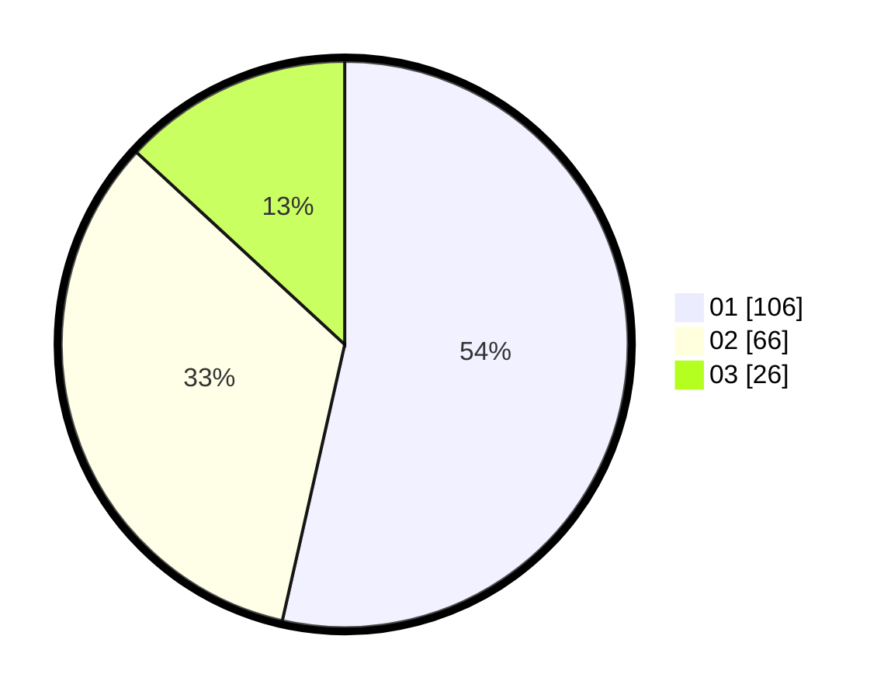

# Hasil

Hasil perolehan suara paslon dapat dilihat pada file paslon-01.txt, paslon-02.txt, dan paslon-03.txt.

Jika tidak ada, artinya data tersebut belum ada pada SIREKAP.

## Perolehan Suara

 * Paslon 01: **106**.
 * Paslon 02: **66**.
 * Paslon 03: **26**.

## Foto C Plano

https://sirekap-obj-formc.kpu.go.id/836c/pemilu/ppwp/31/74/06/10/03/3174061003125-20240215-004137--aab70817-2e15-4ffe-afe8-32a024eddc06.jpg

https://sirekap-obj-formc.kpu.go.id/836c/pemilu/ppwp/31/74/06/10/03/3174061003125-20240215-004334--04a2db7a-ffa1-4211-aeba-367463313798.jpg

https://sirekap-obj-formc.kpu.go.id/836c/pemilu/ppwp/31/74/06/10/03/3174061003125-20240215-004435--0b200e88-2dd1-4c04-9728-d44884f9dfb8.jpg

## DATA PEMILIH TETAP

Jumlah pemilih dalam DPT: **232**.
 * L: **121**.
 * P: **111**.

## DATA PENGGUNA HAK PILIH

Jumlah pengguna hak pilih dalam DPT: **200**.
 * L: **101**.
 * P: **99**.

Jumlah pengguna hak pilih dalam DPTb: **0**.
 * L: **0**.
 * P: **0**.

Jumlah pengguna hak pilih dalam DPK: **0**.
 * L: **0**.
 * P: **0**.

Jumlah pengguna hak pilih: **200**.
 * L: **101**.
 * P: **99**.

## JUMLAH SUARA SAH DAN TIDAK SAH

JUMLAH SELURUH SUARA SAH: **198**.

JUMLAH SUARA TIDAK SAH: **2**.

JUMLAH SELURUH SUARA SAH DAN SUARA TIDAK SAH: **200**.
