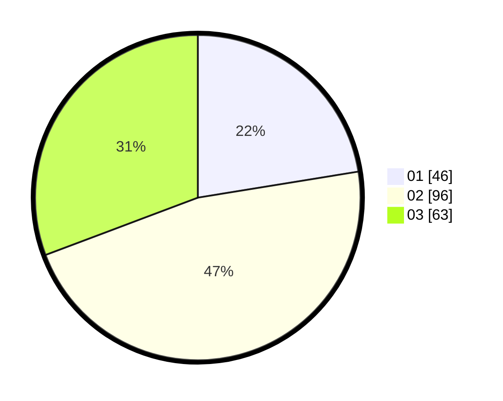

# Hasil

Hasil perolehan suara paslon dapat dilihat pada file paslon-01.txt, paslon-02.txt, dan paslon-03.txt.

Jika tidak ada, artinya data tersebut belum ada pada SIREKAP.

## Perolehan Suara

 * Paslon 01: **46**.
 * Paslon 02: **96**.
 * Paslon 03: **63**.

## Foto C Plano

https://sirekap-obj-formc.kpu.go.id/f398/pemilu/ppwp/31/74/06/10/03/3174061003132-20240216-002319--b8b6caec-40ed-42dc-bf48-5449b6a171da.jpg

https://sirekap-obj-formc.kpu.go.id/f398/pemilu/ppwp/31/74/06/10/03/3174061003132-20240216-002321--69cc705d-7a68-4b27-b9b7-d429acd35722.jpg

https://sirekap-obj-formc.kpu.go.id/f398/pemilu/ppwp/31/74/06/10/03/3174061003132-20240216-024253--fb822246-5274-4bfb-9bd2-98259ac502b2.jpg

## DATA PEMILIH TETAP

Jumlah pemilih dalam DPT: **246**.
 * L: **125**.
 * P: **121**.

## DATA PENGGUNA HAK PILIH

Jumlah pengguna hak pilih dalam DPT: **204**.
 * L: **98**.
 * P: **106**.

Jumlah pengguna hak pilih dalam DPTb: **1**.
 * L: **0**.
 * P: **1**.

Jumlah pengguna hak pilih dalam DPK: **0**.
 * L: **0**.
 * P: **0**.

Jumlah pengguna hak pilih: **205**.
 * L: **98**.
 * P: **107**.

## JUMLAH SUARA SAH DAN TIDAK SAH

JUMLAH SELURUH SUARA SAH: **205**.

JUMLAH SUARA TIDAK SAH: **0**.

JUMLAH SELURUH SUARA SAH DAN SUARA TIDAK SAH: **205**.
