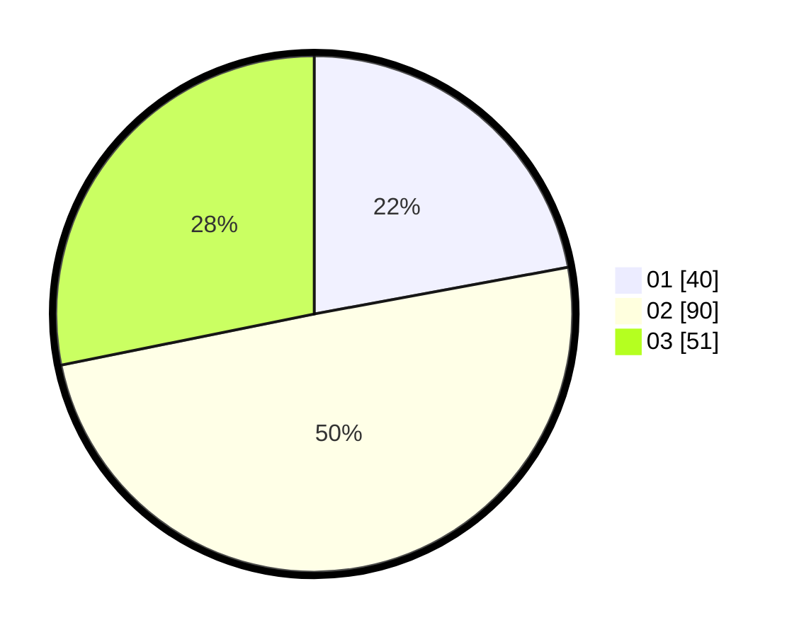

# Hasil

Hasil perolehan suara paslon dapat dilihat pada file paslon-01.txt, paslon-02.txt, dan paslon-03.txt.

Jika tidak ada, artinya data tersebut belum ada pada SIREKAP.

## Perolehan Suara

 * Paslon 01: **40**.
 * Paslon 02: **90**.
 * Paslon 03: **51**.

## Foto C Plano

https://sirekap-obj-formc.kpu.go.id/2057/pemilu/ppwp/31/74/06/10/03/3174061003156-20240215-003402--b355b9f7-f0cc-49d4-9500-07829f82a5b0.jpg

https://sirekap-obj-formc.kpu.go.id/2057/pemilu/ppwp/31/74/06/10/03/3174061003156-20240215-003948--ccdbf3c0-b3ac-4806-8ef8-e98c20bd1f01.jpg

https://sirekap-obj-formc.kpu.go.id/2057/pemilu/ppwp/31/74/06/10/03/3174061003156-20240215-004320--f72195c9-2f9c-4603-9a95-d8ec3af2124a.jpg
