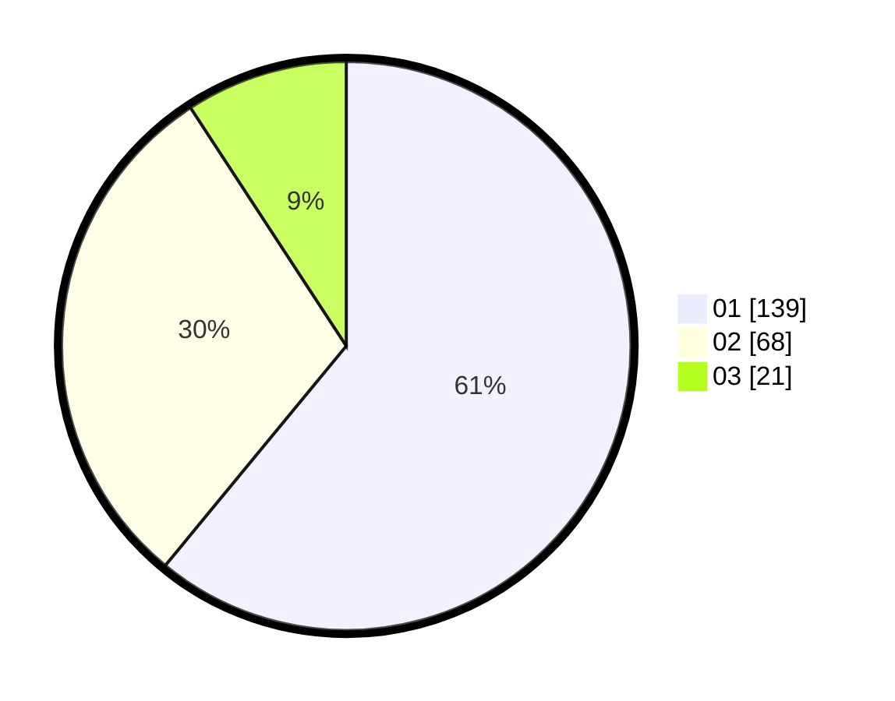

# Hasil

Hasil perolehan suara paslon dapat dilihat pada file paslon-01.txt, paslon-02.txt, dan paslon-03.txt.

Jika tidak ada, artinya data tersebut belum ada pada SIREKAP.

## Perolehan Suara

 * Paslon 01: **139**.
 * Paslon 02: **68**.
 * Paslon 03: **21**.

## Foto C Plano

https://sirekap-obj-formc.kpu.go.id/5aea/pemilu/ppwp/31/74/06/10/04/3174061004001-20240218-175521--c8529e28-591e-4253-bf9c-2197018746c1.jpg

https://sirekap-obj-formc.kpu.go.id/5aea/pemilu/ppwp/31/74/06/10/04/3174061004001-20240218-175645--e69ea54d-4712-4031-8dce-3a246fcfb723.jpg

https://sirekap-obj-formc.kpu.go.id/5aea/pemilu/ppwp/31/74/06/10/04/3174061004001-20240218-175726--9155255f-3616-40a0-be1a-1d20a9440df5.jpg

## DATA PEMILIH TETAP

Jumlah pemilih dalam DPT: **243**.
 * L: **119**.
 * P: **124**.

## DATA PENGGUNA HAK PILIH

Jumlah pengguna hak pilih dalam DPT: **223**.
 * L: **107**.
 * P: **116**.

Jumlah pengguna hak pilih dalam DPTb: **6**.
 * L: **4**.
 * P: **2**.

Jumlah pengguna hak pilih dalam DPK: **0**.
 * L: **0**.
 * P: **0**.

Jumlah pengguna hak pilih: **229**.
 * L: **111**.
 * P: **118**.

## JUMLAH SUARA SAH DAN TIDAK SAH

JUMLAH SELURUH SUARA SAH: **228**.

JUMLAH SUARA TIDAK SAH: **1**.

JUMLAH SELURUH SUARA SAH DAN SUARA TIDAK SAH: **229**.
