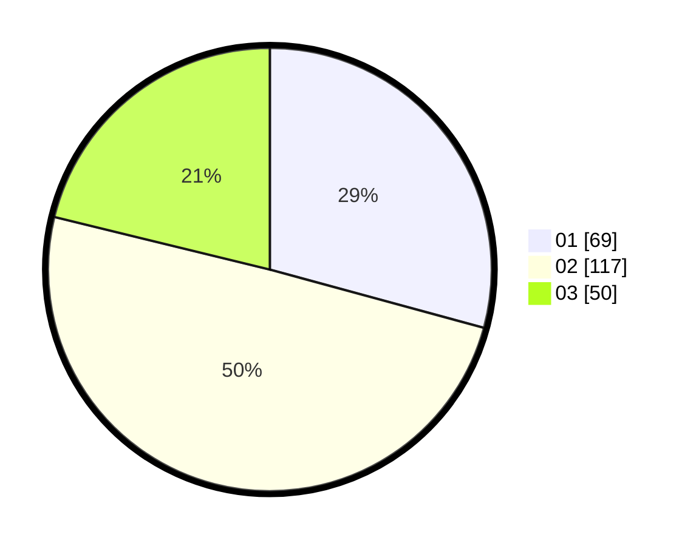

# Hasil

Hasil perolehan suara paslon dapat dilihat pada file paslon-01.txt, paslon-02.txt, dan paslon-03.txt.

Jika tidak ada, artinya data tersebut belum ada pada SIREKAP.

## Perolehan Suara

 * Paslon 01: **69**.
 * Paslon 02: **117**.
 * Paslon 03: **50**.

## Foto C Plano

https://sirekap-obj-formc.kpu.go.id/03d8/pemilu/ppwp/31/74/06/10/04/3174061004007-20240215-182639--863ade98-6269-4008-9152-1e8ee591bab2.jpg

https://sirekap-obj-formc.kpu.go.id/03d8/pemilu/ppwp/31/74/06/10/04/3174061004007-20240215-182700--a5c5490a-3462-43e6-933b-71aa23b94aaa.jpg

https://sirekap-obj-formc.kpu.go.id/03d8/pemilu/ppwp/31/74/06/10/04/3174061004007-20240215-182649--a937c8e0-6c33-4298-88b5-52d2c7773fc7.jpg

## DATA PEMILIH TETAP

Jumlah pemilih dalam DPT: **270**.
 * L: **142**.
 * P: **128**.

## DATA PENGGUNA HAK PILIH

Jumlah pengguna hak pilih dalam DPT: **225**.
 * L: **115**.
 * P: **110**.

Jumlah pengguna hak pilih dalam DPTb: **9**.
 * L: **5**.
 * P: **4**.

Jumlah pengguna hak pilih dalam DPK: **5**.
 * L: **2**.
 * P: **3**.

Jumlah pengguna hak pilih: **239**.
 * L: **122**.
 * P: **117**.

## JUMLAH SUARA SAH DAN TIDAK SAH

JUMLAH SELURUH SUARA SAH: **236**.

JUMLAH SUARA TIDAK SAH: **3**.

JUMLAH SELURUH SUARA SAH DAN SUARA TIDAK SAH: **239**.
