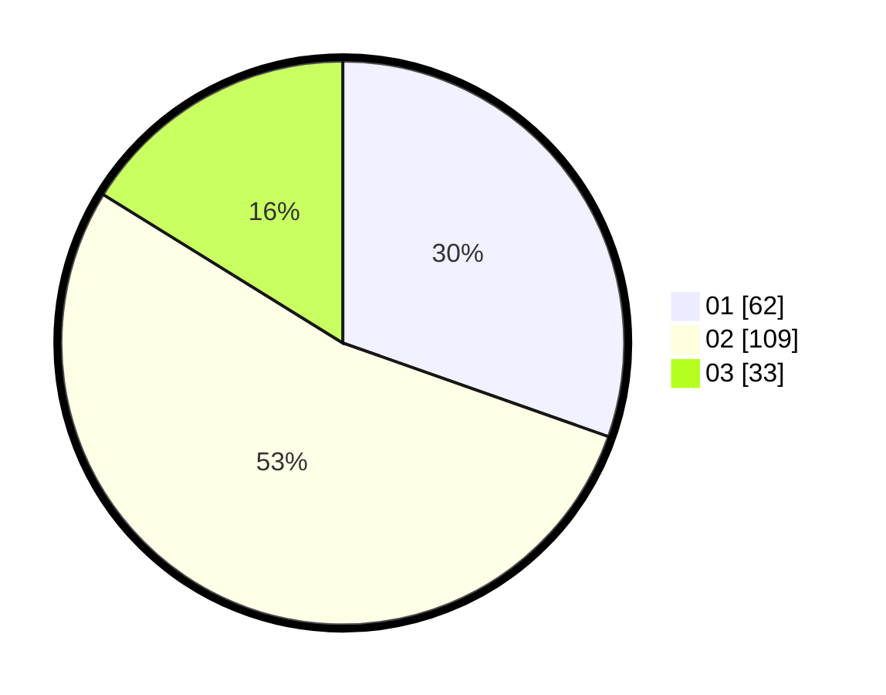

# Hasil

Hasil perolehan suara paslon dapat dilihat pada file paslon-01.txt, paslon-02.txt, dan paslon-03.txt.

Jika tidak ada, artinya data tersebut belum ada pada SIREKAP.

## Perolehan Suara

 * Paslon 01: **62**.
 * Paslon 02: **109**.
 * Paslon 03: **33**.

## Foto C Plano

https://sirekap-obj-formc.kpu.go.id/c575/pemilu/ppwp/31/74/06/10/04/3174061004008-20240217-102721--4ca0729c-97a4-417a-a71d-b4227521064f.jpg

https://sirekap-obj-formc.kpu.go.id/c575/pemilu/ppwp/31/74/06/10/04/3174061004008-20240217-102811--c771d1b3-fdf2-4b17-bb1d-0a6c00cb698d.jpg

https://sirekap-obj-formc.kpu.go.id/c575/pemilu/ppwp/31/74/06/10/04/3174061004008-20240217-102828--c588837a-6e16-4a6e-95f1-a8cd1c7e5e0d.jpg
