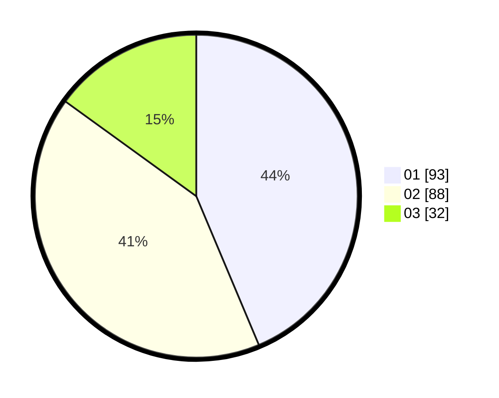

# Hasil

Hasil perolehan suara paslon dapat dilihat pada file paslon-01.txt, paslon-02.txt, dan paslon-03.txt.

Jika tidak ada, artinya data tersebut belum ada pada SIREKAP.

## Perolehan Suara

 * Paslon 01: **93**.
 * Paslon 02: **88**.
 * Paslon 03: **32**.

## Foto C Plano

https://sirekap-obj-formc.kpu.go.id/298d/pemilu/ppwp/31/74/06/10/04/3174061004072-20240216-073300--79f5cfa3-f8f0-431e-af0a-9e4bbb37365c.jpg

https://sirekap-obj-formc.kpu.go.id/298d/pemilu/ppwp/31/74/06/10/04/3174061004072-20240216-073311--2c875ebe-c062-48f7-a9fe-7c2f728e1702.jpg

https://sirekap-obj-formc.kpu.go.id/298d/pemilu/ppwp/31/74/06/10/04/3174061004072-20240216-073302--7b4e20f6-86f4-4ca0-ba43-137c24f407aa.jpg

## DATA PEMILIH TETAP

Jumlah pemilih dalam DPT: **265**.
 * L: **131**.
 * P: **134**.

## DATA PENGGUNA HAK PILIH

Jumlah pengguna hak pilih dalam DPT: **207**.
 * L: **102**.
 * P: **105**.

Jumlah pengguna hak pilih dalam DPTb: **0**.
 * L: **0**.
 * P: **0**.

Jumlah pengguna hak pilih dalam DPK: **8**.
 * L: **6**.
 * P: **2**.

Jumlah pengguna hak pilih: **215**.
 * L: **108**.
 * P: **107**.

## JUMLAH SUARA SAH DAN TIDAK SAH

JUMLAH SELURUH SUARA SAH: **213**.

JUMLAH SUARA TIDAK SAH: **2**.

JUMLAH SELURUH SUARA SAH DAN SUARA TIDAK SAH: **215**.
