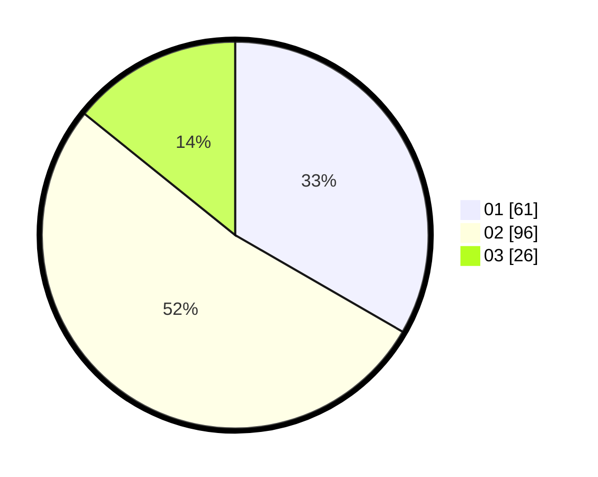

# Hasil

Hasil perolehan suara paslon dapat dilihat pada file paslon-01.txt, paslon-02.txt, dan paslon-03.txt.

Jika tidak ada, artinya data tersebut belum ada pada SIREKAP.

## Perolehan Suara

 * Paslon 01: **61**.
 * Paslon 02: **96**.
 * Paslon 03: **26**.

## Foto C Plano

https://sirekap-obj-formc.kpu.go.id/5d67/pemilu/ppwp/31/74/06/10/05/3174061005002-20240216-160740--494b6d59-5a2d-4e7c-a438-d0af4eac120d.jpg

https://sirekap-obj-formc.kpu.go.id/5d67/pemilu/ppwp/31/74/06/10/05/3174061005002-20240216-160903--1834164f-888b-4ebf-96da-da4f5dc793b1.jpg

https://sirekap-obj-formc.kpu.go.id/5d67/pemilu/ppwp/31/74/06/10/05/3174061005002-20240216-160927--a53a14e8-7bb4-4fc0-97bc-29e60d1b4250.jpg
