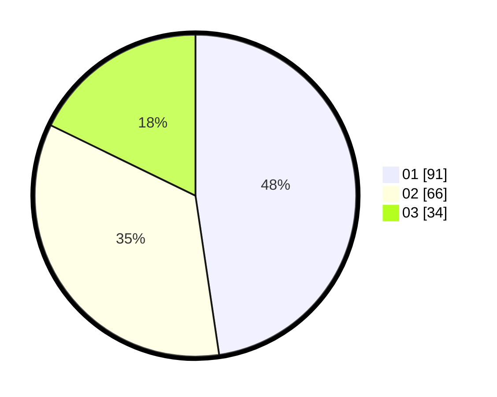

# Hasil

Hasil perolehan suara paslon dapat dilihat pada file paslon-01.txt, paslon-02.txt, dan paslon-03.txt.

Jika tidak ada, artinya data tersebut belum ada pada SIREKAP.

## Perolehan Suara

 * Paslon 01: **91**.
 * Paslon 02: **66**.
 * Paslon 03: **34**.

## Foto C Plano

https://sirekap-obj-formc.kpu.go.id/f856/pemilu/ppwp/31/74/06/10/05/3174061005007-20240216-164606--b2b7d84c-29ec-4604-b028-481ec10d7bf8.jpg

https://sirekap-obj-formc.kpu.go.id/f856/pemilu/ppwp/31/74/06/10/05/3174061005007-20240216-164716--5ec207bc-1342-4948-8e72-15e909a19abc.jpg

https://sirekap-obj-formc.kpu.go.id/f856/pemilu/ppwp/31/74/06/10/05/3174061005007-20240216-164757--41efc3e5-95d9-4fbf-aabc-30df24dc599e.jpg
