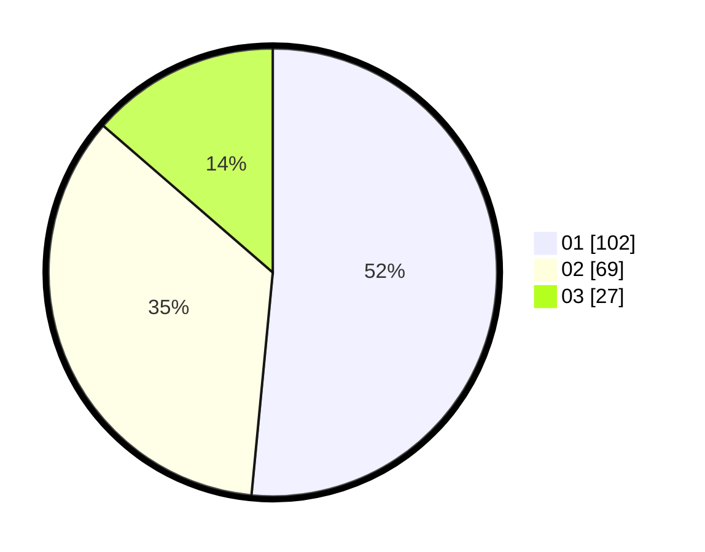

# Hasil

Hasil perolehan suara paslon dapat dilihat pada file paslon-01.txt, paslon-02.txt, dan paslon-03.txt.

Jika tidak ada, artinya data tersebut belum ada pada SIREKAP.

## Perolehan Suara

 * Paslon 01: **102**.
 * Paslon 02: **69**.
 * Paslon 03: **27**.

## Foto C Plano

https://sirekap-obj-formc.kpu.go.id/993b/pemilu/ppwp/31/74/06/10/05/3174061005008-20240216-165043--7481c010-42aa-452d-ac36-6446f97d7542.jpg

https://sirekap-obj-formc.kpu.go.id/993b/pemilu/ppwp/31/74/06/10/05/3174061005008-20240216-165145--28fa9e54-de8f-43cf-8092-5720da80bfb5.jpg

https://sirekap-obj-formc.kpu.go.id/993b/pemilu/ppwp/31/74/06/10/05/3174061005008-20240216-165217--ee23c48a-32f8-43e7-910f-4db948a8ebfc.jpg
