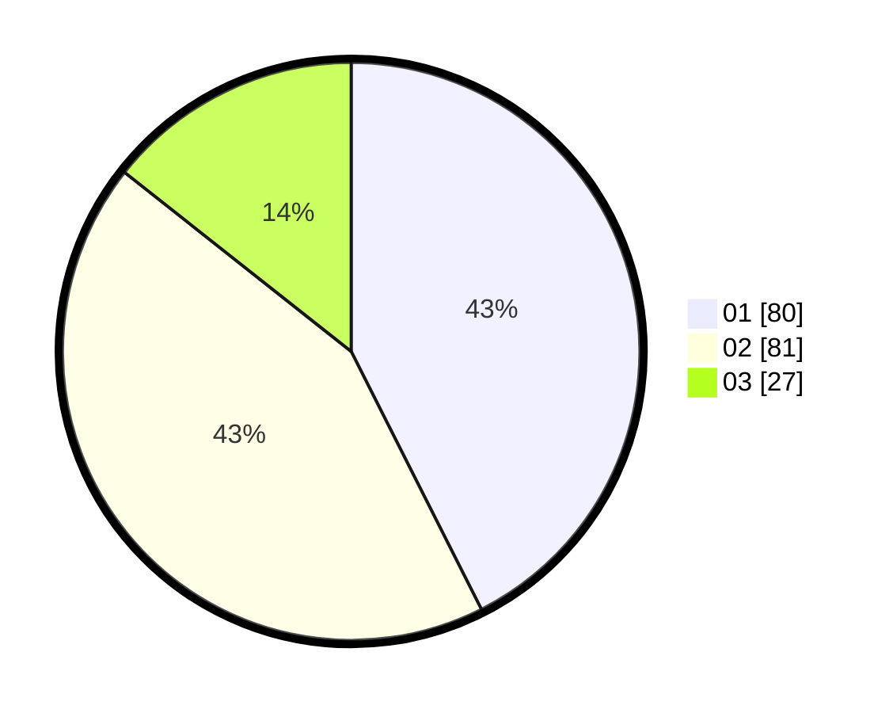

# Hasil

Hasil perolehan suara paslon dapat dilihat pada file paslon-01.txt, paslon-02.txt, dan paslon-03.txt.

Jika tidak ada, artinya data tersebut belum ada pada SIREKAP.

## Perolehan Suara

 * Paslon 01: **80**.
 * Paslon 02: **81**.
 * Paslon 03: **27**.

## Foto C Plano

https://sirekap-obj-formc.kpu.go.id/acdf/pemilu/ppwp/31/74/06/10/05/3174061005089-20240214-155346--b7b8ad51-df2c-4741-9319-43bf600c6a1a.jpg

https://sirekap-obj-formc.kpu.go.id/acdf/pemilu/ppwp/31/74/06/10/05/3174061005089-20240214-155503--9e681f16-3cd5-4f51-aa89-164037874886.jpg

https://sirekap-obj-formc.kpu.go.id/acdf/pemilu/ppwp/31/74/06/10/05/3174061005089-20240214-155627--50ef47c5-5691-49cc-a10e-395c77a93cb9.jpg

## DATA PEMILIH TETAP

Jumlah pemilih dalam DPT: **231**.
 * L: **113**.
 * P: **118**.

## DATA PENGGUNA HAK PILIH

Jumlah pengguna hak pilih dalam DPT: **190**.
 * L: **97**.
 * P: **93**.

Jumlah pengguna hak pilih dalam DPTb: **1**.
 * L: **1**.
 * P: **0**.

Jumlah pengguna hak pilih dalam DPK: **0**.
 * L: **0**.
 * P: **0**.

Jumlah pengguna hak pilih: **191**.
 * L: **98**.
 * P: **93**.

## JUMLAH SUARA SAH DAN TIDAK SAH

JUMLAH SELURUH SUARA SAH: **188**.

JUMLAH SUARA TIDAK SAH: **3**.

JUMLAH SELURUH SUARA SAH DAN SUARA TIDAK SAH: **191**.
