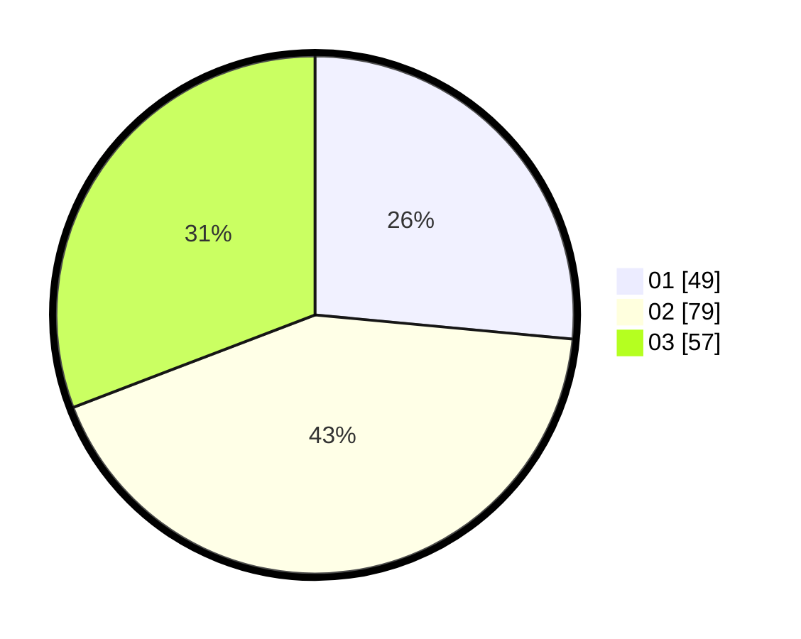

# Hasil

Hasil perolehan suara paslon dapat dilihat pada file paslon-01.txt, paslon-02.txt, dan paslon-03.txt.

Jika tidak ada, artinya data tersebut belum ada pada SIREKAP.

## Perolehan Suara

 * Paslon 01: **49**.
 * Paslon 02: **79**.
 * Paslon 03: **57**.

## Foto C Plano

https://sirekap-obj-formc.kpu.go.id/570c/pemilu/ppwp/31/74/07/10/01/3174071001001-20240214-184520--6fc63efe-1a31-4fd4-bbce-e21212e6ce5c.jpg

https://sirekap-obj-formc.kpu.go.id/570c/pemilu/ppwp/31/74/07/10/01/3174071001001-20240214-184541--400269d9-33ba-45a2-803d-77e7a37dbdf1.jpg

https://sirekap-obj-formc.kpu.go.id/570c/pemilu/ppwp/31/74/07/10/01/3174071001001-20240214-184858--0b623ed1-4973-4a5d-9345-b6691b826022.jpg

## DATA PEMILIH TETAP

Jumlah pemilih dalam DPT: **223**.
 * L: **100**.
 * P: **123**.

## DATA PENGGUNA HAK PILIH

Jumlah pengguna hak pilih dalam DPT: **168**.
 * L: **71**.
 * P: **97**.

Jumlah pengguna hak pilih dalam DPTb: **19**.
 * L: **7**.
 * P: **12**.

Jumlah pengguna hak pilih dalam DPK: **2**.
 * L: **1**.
 * P: **1**.

Jumlah pengguna hak pilih: **189**.
 * L: **79**.
 * P: **110**.

## JUMLAH SUARA SAH DAN TIDAK SAH

JUMLAH SELURUH SUARA SAH: **185**.

JUMLAH SUARA TIDAK SAH: **4**.

JUMLAH SELURUH SUARA SAH DAN SUARA TIDAK SAH: **189**.
