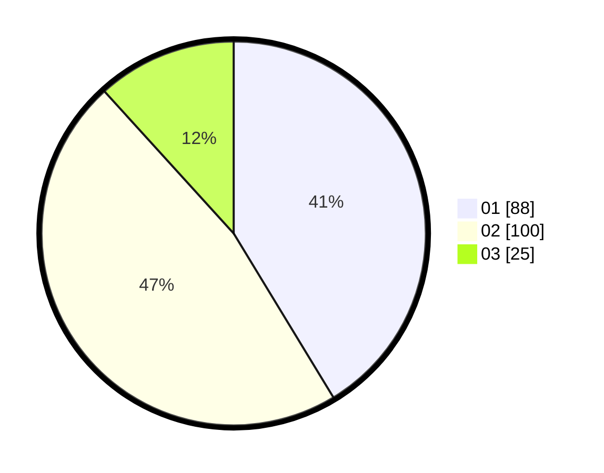

# Hasil

Hasil perolehan suara paslon dapat dilihat pada file paslon-01.txt, paslon-02.txt, dan paslon-03.txt.

Jika tidak ada, artinya data tersebut belum ada pada SIREKAP.

## Perolehan Suara

 * Paslon 01: **88**.
 * Paslon 02: **100**.
 * Paslon 03: **25**.

## Foto C Plano

https://sirekap-obj-formc.kpu.go.id/55b0/pemilu/ppwp/31/74/07/10/02/3174071002003-20240216-140142--fd4d59d2-47bd-48a9-b62b-c6f619262ce0.jpg

https://sirekap-obj-formc.kpu.go.id/55b0/pemilu/ppwp/31/74/07/10/02/3174071002003-20240216-140143--758d72f3-0ec0-48cd-969b-2bf035b84318.jpg

https://sirekap-obj-formc.kpu.go.id/55b0/pemilu/ppwp/31/74/07/10/02/3174071002003-20240216-140143--fc14b732-745d-4e6d-91ca-34e7ab5c4bed.jpg

## DATA PEMILIH TETAP

Jumlah pemilih dalam DPT: **266**.
 * L: **146**.
 * P: **120**.

## DATA PENGGUNA HAK PILIH

Jumlah pengguna hak pilih dalam DPT: **203**.
 * L: **105**.
 * P: **98**.

Jumlah pengguna hak pilih dalam DPTb: **12**.
 * L: **7**.
 * P: **5**.

Jumlah pengguna hak pilih dalam DPK: **0**.
 * L: **0**.
 * P: **0**.

Jumlah pengguna hak pilih: **215**.
 * L: **112**.
 * P: **103**.

## JUMLAH SUARA SAH DAN TIDAK SAH

JUMLAH SELURUH SUARA SAH: **213**.

JUMLAH SUARA TIDAK SAH: **2**.

JUMLAH SELURUH SUARA SAH DAN SUARA TIDAK SAH: **215**.
