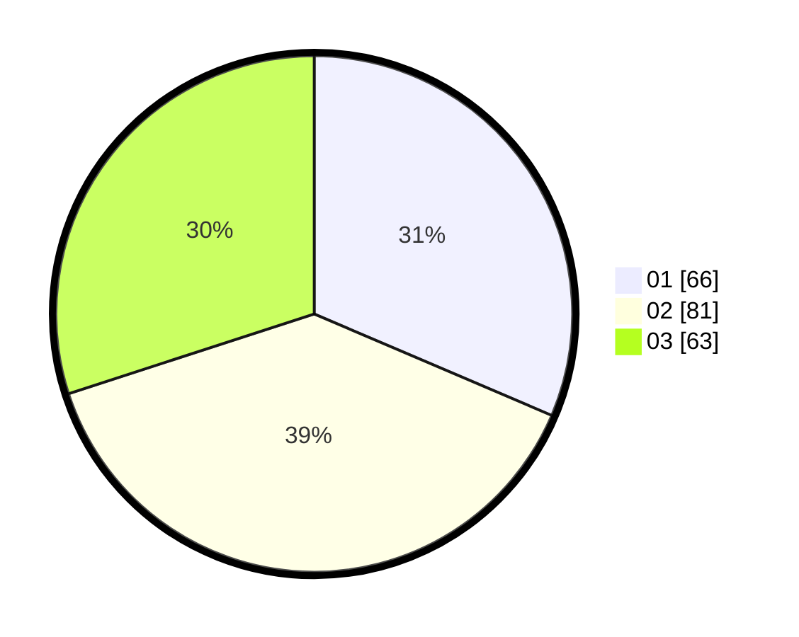

# Hasil

Hasil perolehan suara paslon dapat dilihat pada file paslon-01.txt, paslon-02.txt, dan paslon-03.txt.

Jika tidak ada, artinya data tersebut belum ada pada SIREKAP.

## Perolehan Suara

 * Paslon 01: **66**.
 * Paslon 02: **81**.
 * Paslon 03: **63**.

## Foto C Plano

https://sirekap-obj-formc.kpu.go.id/0c2f/pemilu/ppwp/31/74/07/10/03/3174071003004-20240214-194006--0e9c0945-e7ea-43e4-b877-ada4af352dcb.jpg

https://sirekap-obj-formc.kpu.go.id/0c2f/pemilu/ppwp/31/74/07/10/03/3174071003004-20240214-155138--185b5f63-a30e-44f8-bb51-a6b0236066da.jpg

https://sirekap-obj-formc.kpu.go.id/0c2f/pemilu/ppwp/31/74/07/10/03/3174071003004-20240214-210239--5eb9e889-49f8-4154-82e5-2335dd66fd94.jpg
