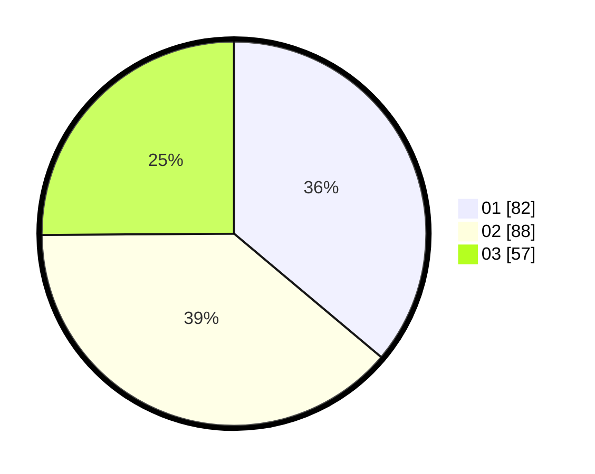

# Hasil

Hasil perolehan suara paslon dapat dilihat pada file paslon-01.txt, paslon-02.txt, dan paslon-03.txt.

Jika tidak ada, artinya data tersebut belum ada pada SIREKAP.

## Perolehan Suara

 * Paslon 01: **82**.
 * Paslon 02: **88**.
 * Paslon 03: **57**.

## Foto C Plano

https://sirekap-obj-formc.kpu.go.id/8a1e/pemilu/ppwp/31/74/07/10/03/3174071003007-20240214-195951--8bbcc5c0-9af5-4af7-a76b-82ebc7613196.jpg

https://sirekap-obj-formc.kpu.go.id/8a1e/pemilu/ppwp/31/74/07/10/03/3174071003007-20240214-200005--7436cf1b-8618-4f4b-a2c9-d963ef575141.jpg

https://sirekap-obj-formc.kpu.go.id/8a1e/pemilu/ppwp/31/74/07/10/03/3174071003007-20240214-200005--381fa12c-d85c-41d7-ad8f-6c78b409b1cc.jpg

## DATA PEMILIH TETAP

Jumlah pemilih dalam DPT: **295**.
 * L: **146**.
 * P: **149**.

## DATA PENGGUNA HAK PILIH

Jumlah pengguna hak pilih dalam DPT: **223**.
 * L: **110**.
 * P: **113**.

Jumlah pengguna hak pilih dalam DPTb: **5**.
 * L: **1**.
 * P: **4**.

Jumlah pengguna hak pilih dalam DPK: **0**.
 * L: **0**.
 * P: **0**.

Jumlah pengguna hak pilih: **228**.
 * L: **111**.
 * P: **117**.

## JUMLAH SUARA SAH DAN TIDAK SAH

JUMLAH SELURUH SUARA SAH: **227**.

JUMLAH SUARA TIDAK SAH: **1**.

JUMLAH SELURUH SUARA SAH DAN SUARA TIDAK SAH: **228**.
