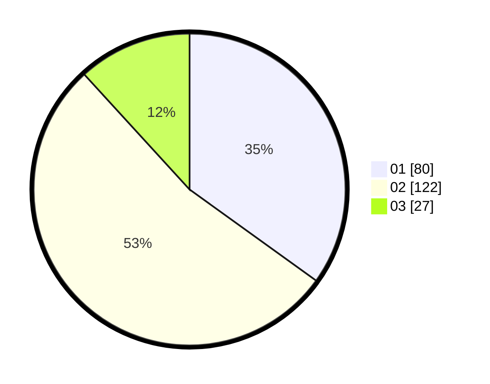

# Hasil

Hasil perolehan suara paslon dapat dilihat pada file paslon-01.txt, paslon-02.txt, dan paslon-03.txt.

Jika tidak ada, artinya data tersebut belum ada pada SIREKAP.

## Perolehan Suara

 * Paslon 01: **80**.
 * Paslon 02: **122**.
 * Paslon 03: **27**.

## Foto C Plano

https://sirekap-obj-formc.kpu.go.id/497b/pemilu/ppwp/31/74/07/10/03/3174071003008-20240218-110333--6753a444-c79d-4a74-b042-37165bc13bcc.jpg

https://sirekap-obj-formc.kpu.go.id/497b/pemilu/ppwp/31/74/07/10/03/3174071003008-20240218-111035--6385aa8f-dc9a-4f88-b7c0-d3cb5962c885.jpg

https://sirekap-obj-formc.kpu.go.id/497b/pemilu/ppwp/31/74/07/10/03/3174071003008-20240218-111317--046effbb-eaa4-45c6-98ba-0b282a477a14.jpg

## DATA PEMILIH TETAP

Jumlah pemilih dalam DPT: **280**.
 * L: **144**.
 * P: **136**.

## DATA PENGGUNA HAK PILIH

Jumlah pengguna hak pilih dalam DPT: **223**.
 * L: **108**.
 * P: **115**.

Jumlah pengguna hak pilih dalam DPTb: **8**.
 * L: **5**.
 * P: **3**.

Jumlah pengguna hak pilih dalam DPK: **0**.
 * L: **0**.
 * P: **0**.

Jumlah pengguna hak pilih: **231**.
 * L: **113**.
 * P: **118**.

## JUMLAH SUARA SAH DAN TIDAK SAH

JUMLAH SELURUH SUARA SAH: **229**.

JUMLAH SUARA TIDAK SAH: **2**.

JUMLAH SELURUH SUARA SAH DAN SUARA TIDAK SAH: **231**.
