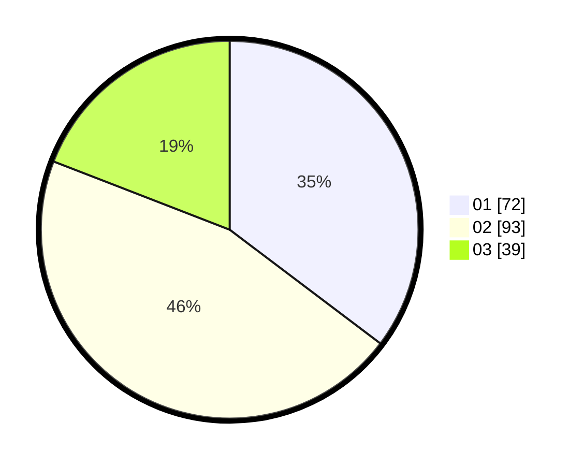

# Hasil

Hasil perolehan suara paslon dapat dilihat pada file paslon-01.txt, paslon-02.txt, dan paslon-03.txt.

Jika tidak ada, artinya data tersebut belum ada pada SIREKAP.

## Perolehan Suara

 * Paslon 01: **72**.
 * Paslon 02: **93**.
 * Paslon 03: **39**.

## Foto C Plano

https://sirekap-obj-formc.kpu.go.id/df16/pemilu/ppwp/31/74/07/10/03/3174071003011-20240218-104219--8a037337-c270-40a6-9bda-2541deb19ce6.jpg

https://sirekap-obj-formc.kpu.go.id/df16/pemilu/ppwp/31/74/07/10/03/3174071003011-20240218-104359--447c5982-d635-4a62-9a62-ae318794c1f0.jpg

https://sirekap-obj-formc.kpu.go.id/df16/pemilu/ppwp/31/74/07/10/03/3174071003011-20240218-104831--a589e635-3d46-4573-b560-9b090a48c139.jpg

## DATA PEMILIH TETAP

Jumlah pemilih dalam DPT: **295**.
 * L: **149**.
 * P: **146**.

## DATA PENGGUNA HAK PILIH

Jumlah pengguna hak pilih dalam DPT: **209**.
 * L: **105**.
 * P: **104**.

Jumlah pengguna hak pilih dalam DPTb: **3**.
 * L: **2**.
 * P: **1**.

Jumlah pengguna hak pilih dalam DPK: **2**.
 * L: **1**.
 * P: **1**.

Jumlah pengguna hak pilih: **214**.
 * L: **108**.
 * P: **106**.

## JUMLAH SUARA SAH DAN TIDAK SAH

JUMLAH SELURUH SUARA SAH: **204**.

JUMLAH SUARA TIDAK SAH: **10**.

JUMLAH SELURUH SUARA SAH DAN SUARA TIDAK SAH: **214**.
