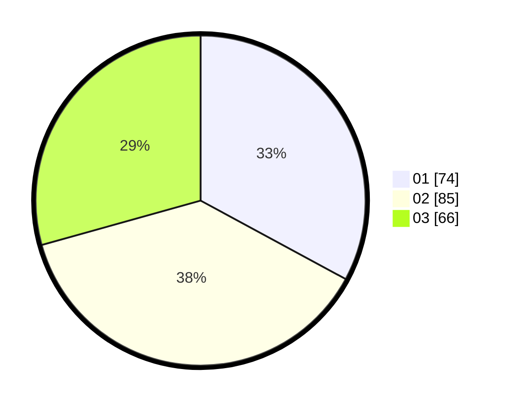

# Hasil

Hasil perolehan suara paslon dapat dilihat pada file paslon-01.txt, paslon-02.txt, dan paslon-03.txt.

Jika tidak ada, artinya data tersebut belum ada pada SIREKAP.

## Perolehan Suara

 * Paslon 01: **74**.
 * Paslon 02: **85**.
 * Paslon 03: **66**.

## Foto C Plano

https://sirekap-obj-formc.kpu.go.id/bc3c/pemilu/ppwp/31/74/07/10/03/3174071003013-20240218-143510--2f13d85f-9774-4612-83fc-4795a8c588ae.jpg

https://sirekap-obj-formc.kpu.go.id/bc3c/pemilu/ppwp/31/74/07/10/03/3174071003013-20240218-145140--d1f12ad0-faa6-4e8f-b75f-b516f9636713.jpg

https://sirekap-obj-formc.kpu.go.id/bc3c/pemilu/ppwp/31/74/07/10/03/3174071003013-20240218-145931--ce893fbc-8852-472c-aa95-077666e95da6.jpg

## DATA PEMILIH TETAP

Jumlah pemilih dalam DPT: **279**.
 * L: **139**.
 * P: **140**.

## DATA PENGGUNA HAK PILIH

Jumlah pengguna hak pilih dalam DPT: **212**.
 * L: **111**.
 * P: **101**.

Jumlah pengguna hak pilih dalam DPTb: **12**.
 * L: **7**.
 * P: **5**.

Jumlah pengguna hak pilih dalam DPK: **3**.
 * L: **1**.
 * P: **2**.

Jumlah pengguna hak pilih: **227**.
 * L: **119**.
 * P: **108**.

## JUMLAH SUARA SAH DAN TIDAK SAH

JUMLAH SELURUH SUARA SAH: **225**.

JUMLAH SUARA TIDAK SAH: **2**.

JUMLAH SELURUH SUARA SAH DAN SUARA TIDAK SAH: **227**.
