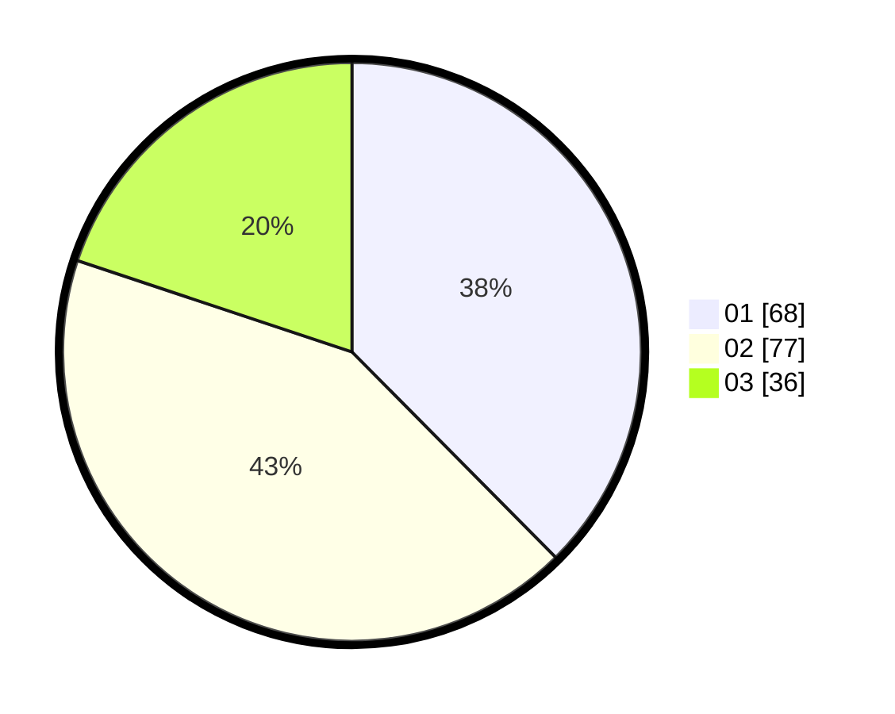

# Hasil

Hasil perolehan suara paslon dapat dilihat pada file paslon-01.txt, paslon-02.txt, dan paslon-03.txt.

Jika tidak ada, artinya data tersebut belum ada pada SIREKAP.

## Perolehan Suara

 * Paslon 01: **68**.
 * Paslon 02: **77**.
 * Paslon 03: **36**.

## Foto C Plano

https://sirekap-obj-formc.kpu.go.id/0655/pemilu/ppwp/31/74/07/10/03/3174071003029-20240214-214310--ba5d34af-9e00-4095-8407-c7dea19c20dc.jpg

https://sirekap-obj-formc.kpu.go.id/0655/pemilu/ppwp/31/74/07/10/03/3174071003029-20240214-214426--af6592b3-244b-4492-af0d-18c72fcece58.jpg

https://sirekap-obj-formc.kpu.go.id/0655/pemilu/ppwp/31/74/07/10/03/3174071003029-20240214-214529--f140b849-f954-4b66-926f-1e05ac453748.jpg

## DATA PEMILIH TETAP

Jumlah pemilih dalam DPT: **226**.
 * L: **112**.
 * P: **114**.

## DATA PENGGUNA HAK PILIH

Jumlah pengguna hak pilih dalam DPT: **179**.
 * L: **88**.
 * P: **91**.

Jumlah pengguna hak pilih dalam DPTb: **4**.
 * L: **3**.
 * P: **1**.

Jumlah pengguna hak pilih dalam DPK: **1**.
 * L: **0**.
 * P: **1**.

Jumlah pengguna hak pilih: **184**.
 * L: **91**.
 * P: **93**.

## JUMLAH SUARA SAH DAN TIDAK SAH

JUMLAH SELURUH SUARA SAH: **181**.

JUMLAH SUARA TIDAK SAH: **3**.

JUMLAH SELURUH SUARA SAH DAN SUARA TIDAK SAH: **184**.
