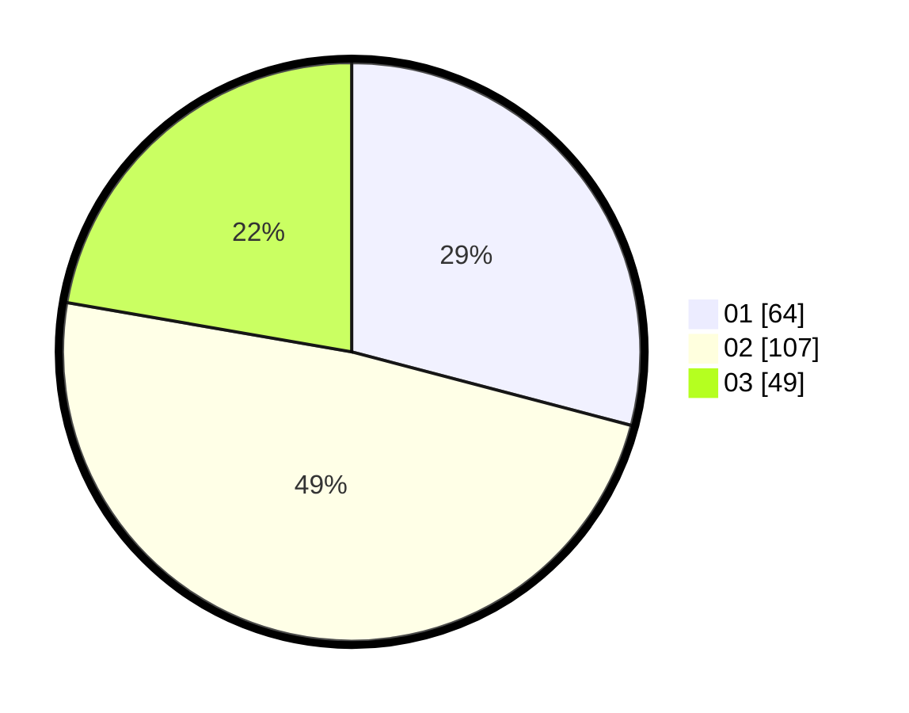

# Hasil

Hasil perolehan suara paslon dapat dilihat pada file paslon-01.txt, paslon-02.txt, dan paslon-03.txt.

Jika tidak ada, artinya data tersebut belum ada pada SIREKAP.

## Perolehan Suara

 * Paslon 01: **64**.
 * Paslon 02: **107**.
 * Paslon 03: **49**.

## Foto C Plano

https://sirekap-obj-formc.kpu.go.id/3566/pemilu/ppwp/31/74/07/10/03/3174071003032-20240218-222858--7a8af322-dbfc-4e94-857a-49ce4981a952.jpg

https://sirekap-obj-formc.kpu.go.id/3566/pemilu/ppwp/31/74/07/10/03/3174071003032-20240218-221248--934f28b1-c46a-4fef-b864-2da326787487.jpg

https://sirekap-obj-formc.kpu.go.id/3566/pemilu/ppwp/31/74/07/10/03/3174071003032-20240218-221313--fda7719c-5c35-4981-a23b-1347f3ca65ff.jpg

## DATA PEMILIH TETAP

Jumlah pemilih dalam DPT: **295**.
 * L: **148**.
 * P: **147**.

## DATA PENGGUNA HAK PILIH

Jumlah pengguna hak pilih dalam DPT: **222**.
 * L: **110**.
 * P: **112**.

Jumlah pengguna hak pilih dalam DPTb: **0**.
 * L: **0**.
 * P: **0**.

Jumlah pengguna hak pilih dalam DPK: **0**.
 * L: **0**.
 * P: **0**.

Jumlah pengguna hak pilih: **222**.
 * L: **110**.
 * P: **112**.

## JUMLAH SUARA SAH DAN TIDAK SAH

JUMLAH SELURUH SUARA SAH: **220**.

JUMLAH SUARA TIDAK SAH: **2**.

JUMLAH SELURUH SUARA SAH DAN SUARA TIDAK SAH: **222**.
