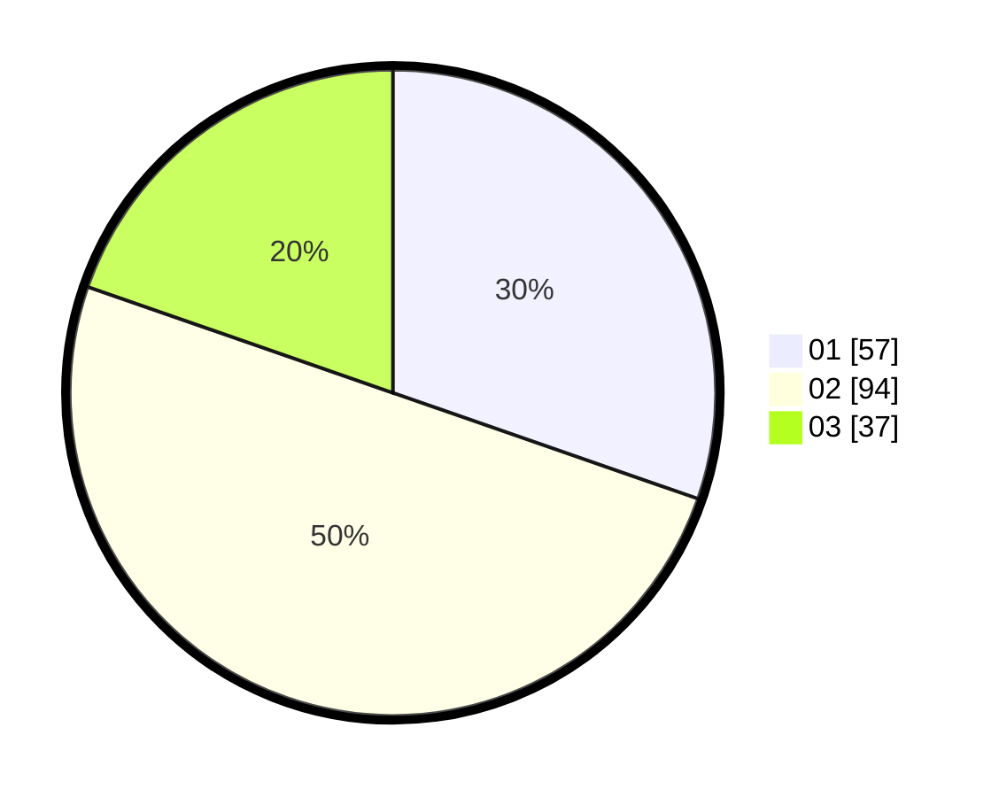

# Hasil

Hasil perolehan suara paslon dapat dilihat pada file paslon-01.txt, paslon-02.txt, dan paslon-03.txt.

Jika tidak ada, artinya data tersebut belum ada pada SIREKAP.

## Perolehan Suara

 * Paslon 01: **57**.
 * Paslon 02: **94**.
 * Paslon 03: **37**.

## Foto C Plano

https://sirekap-obj-formc.kpu.go.id/a045/pemilu/ppwp/31/74/07/10/03/3174071003033-20240218-215925--2fb55c15-ef6f-486e-8ac2-b8896580698c.jpg

https://sirekap-obj-formc.kpu.go.id/a045/pemilu/ppwp/31/74/07/10/03/3174071003033-20240214-225307--cc74ed24-6e8b-40e5-b85e-062e3134c73c.jpg

https://sirekap-obj-formc.kpu.go.id/a045/pemilu/ppwp/31/74/07/10/03/3174071003033-20240214-225415--4ea5331e-8996-443e-a215-bbc9baab8ed6.jpg

## DATA PEMILIH TETAP

Jumlah pemilih dalam DPT: **269**.
 * L: **147**.
 * P: **122**.

## DATA PENGGUNA HAK PILIH

Jumlah pengguna hak pilih dalam DPT: **790**.
 * L: **3**.
 * P: **287**.

Jumlah pengguna hak pilih dalam DPTb: **1**.
 * L: **0**.
 * P: **1**.

Jumlah pengguna hak pilih dalam DPK: **1**.
 * L: **0**.
 * P: **1**.

Jumlah pengguna hak pilih: **192**.
 * L: **0**.
 * P: **0**.

## JUMLAH SUARA SAH DAN TIDAK SAH

JUMLAH SELURUH SUARA SAH: **188**.

JUMLAH SUARA TIDAK SAH: **4**.

JUMLAH SELURUH SUARA SAH DAN SUARA TIDAK SAH: **192**.
