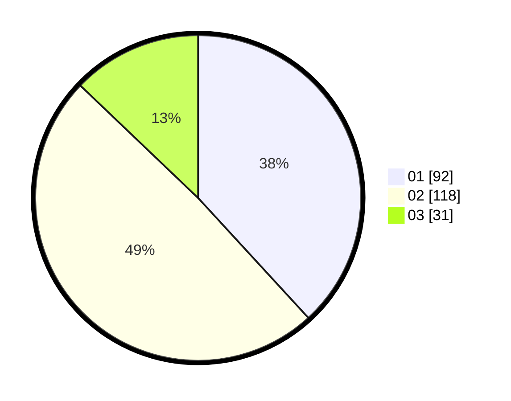

# Hasil

Hasil perolehan suara paslon dapat dilihat pada file paslon-01.txt, paslon-02.txt, dan paslon-03.txt.

Jika tidak ada, artinya data tersebut belum ada pada SIREKAP.

## Perolehan Suara

 * Paslon 01: **92**.
 * Paslon 02: **118**.
 * Paslon 03: **31**.

## Foto C Plano

https://sirekap-obj-formc.kpu.go.id/f9cf/pemilu/ppwp/31/74/07/10/03/3174071003035-20240218-204742--2cca5d9a-72cd-48c8-ab5a-e694d4c3099c.jpg

https://sirekap-obj-formc.kpu.go.id/f9cf/pemilu/ppwp/31/74/07/10/03/3174071003035-20240218-210324--28476e93-a841-444d-9349-17680ce4311c.jpg

https://sirekap-obj-formc.kpu.go.id/f9cf/pemilu/ppwp/31/74/07/10/03/3174071003035-20240218-210713--3033b923-54c8-4ff0-bf83-790ddee288a3.jpg

## DATA PEMILIH TETAP

Jumlah pemilih dalam DPT: **294**.
 * L: **157**.
 * P: **137**.

## DATA PENGGUNA HAK PILIH

Jumlah pengguna hak pilih dalam DPT: **239**.
 * L: **121**.
 * P: **118**.

Jumlah pengguna hak pilih dalam DPTb: **3**.
 * L: **0**.
 * P: **3**.

Jumlah pengguna hak pilih dalam DPK: **2**.
 * L: **0**.
 * P: **2**.

Jumlah pengguna hak pilih: **244**.
 * L: **121**.
 * P: **123**.

## JUMLAH SUARA SAH DAN TIDAK SAH

JUMLAH SELURUH SUARA SAH: **241**.

JUMLAH SUARA TIDAK SAH: **3**.

JUMLAH SELURUH SUARA SAH DAN SUARA TIDAK SAH: **244**.
