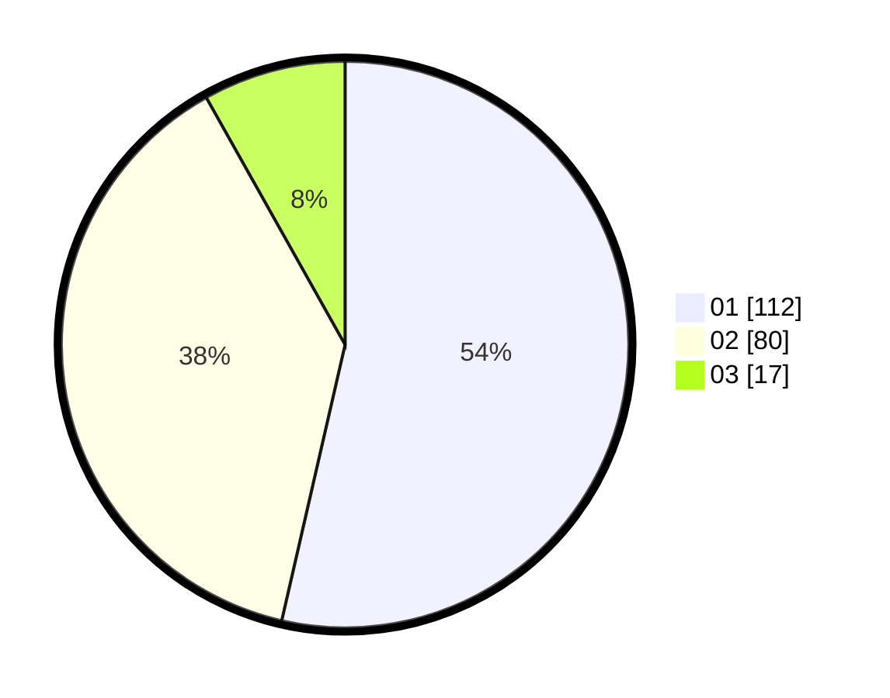

# Hasil

Hasil perolehan suara paslon dapat dilihat pada file paslon-01.txt, paslon-02.txt, dan paslon-03.txt.

Jika tidak ada, artinya data tersebut belum ada pada SIREKAP.

## Perolehan Suara

 * Paslon 01: **112**.
 * Paslon 02: **80**.
 * Paslon 03: **17**.

## Foto C Plano

https://sirekap-obj-formc.kpu.go.id/2237/pemilu/ppwp/31/74/07/10/03/3174071003037-20240218-214219--1ae0329f-a857-4806-8c3a-90c83a3a92a3.jpg

https://sirekap-obj-formc.kpu.go.id/2237/pemilu/ppwp/31/74/07/10/03/3174071003037-20240218-214634--f314b545-083a-42ce-a14b-321abd355562.jpg

https://sirekap-obj-formc.kpu.go.id/2237/pemilu/ppwp/31/74/07/10/03/3174071003037-20240218-214816--c764d7c2-b93b-47fb-9088-8f00ef0a990c.jpg

## DATA PEMILIH TETAP

Jumlah pemilih dalam DPT: **254**.
 * L: **110**.
 * P: **144**.

## DATA PENGGUNA HAK PILIH

Jumlah pengguna hak pilih dalam DPT: **203**.
 * L: **89**.
 * P: **114**.

Jumlah pengguna hak pilih dalam DPTb: **3**.
 * L: **0**.
 * P: **3**.

Jumlah pengguna hak pilih dalam DPK: **0**.
 * L: **0**.
 * P: **0**.

Jumlah pengguna hak pilih: **206**.
 * L: **89**.
 * P: **117**.

## JUMLAH SUARA SAH DAN TIDAK SAH

JUMLAH SELURUH SUARA SAH: **209**.

JUMLAH SUARA TIDAK SAH: **1**.

JUMLAH SELURUH SUARA SAH DAN SUARA TIDAK SAH: **210**.
