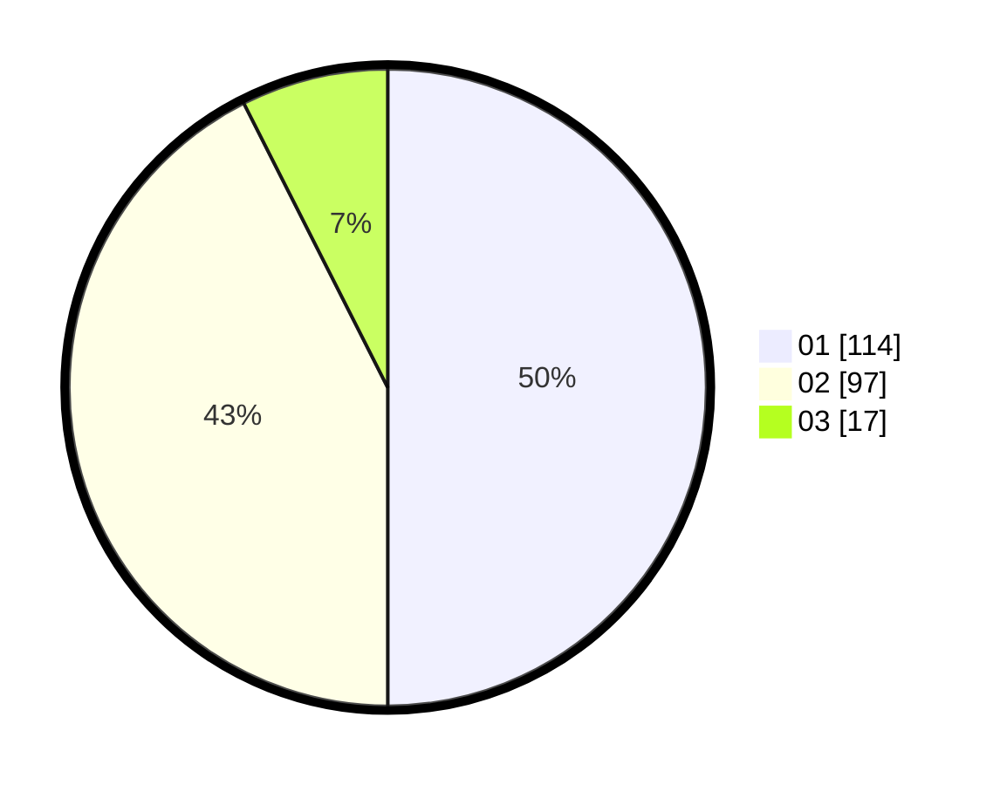

# Hasil

Hasil perolehan suara paslon dapat dilihat pada file paslon-01.txt, paslon-02.txt, dan paslon-03.txt.

Jika tidak ada, artinya data tersebut belum ada pada SIREKAP.

## Perolehan Suara

 * Paslon 01: **114**.
 * Paslon 02: **97**.
 * Paslon 03: **17**.

## Foto C Plano

https://sirekap-obj-formc.kpu.go.id/abfb/pemilu/ppwp/31/74/07/10/03/3174071003038-20240218-204220--46280894-4aa4-4bd5-9ffd-341665e99c23.jpg

https://sirekap-obj-formc.kpu.go.id/abfb/pemilu/ppwp/31/74/07/10/03/3174071003038-20240218-204638--8c143492-2671-4cfb-b9ec-f352a7289823.jpg

https://sirekap-obj-formc.kpu.go.id/abfb/pemilu/ppwp/31/74/07/10/03/3174071003038-20240218-204922--d8cab0ab-5b54-4bca-a09e-a35c02eb708a.jpg

## DATA PEMILIH TETAP

Jumlah pemilih dalam DPT: **270**.
 * L: **134**.
 * P: **136**.

## DATA PENGGUNA HAK PILIH

Jumlah pengguna hak pilih dalam DPT: **225**.
 * L: **109**.
 * P: **116**.

Jumlah pengguna hak pilih dalam DPTb: **5**.
 * L: **1**.
 * P: **4**.

Jumlah pengguna hak pilih dalam DPK: **0**.
 * L: **0**.
 * P: **0**.

Jumlah pengguna hak pilih: **230**.
 * L: **110**.
 * P: **120**.

## JUMLAH SUARA SAH DAN TIDAK SAH

JUMLAH SELURUH SUARA SAH: **228**.

JUMLAH SUARA TIDAK SAH: **2**.

JUMLAH SELURUH SUARA SAH DAN SUARA TIDAK SAH: **230**.
