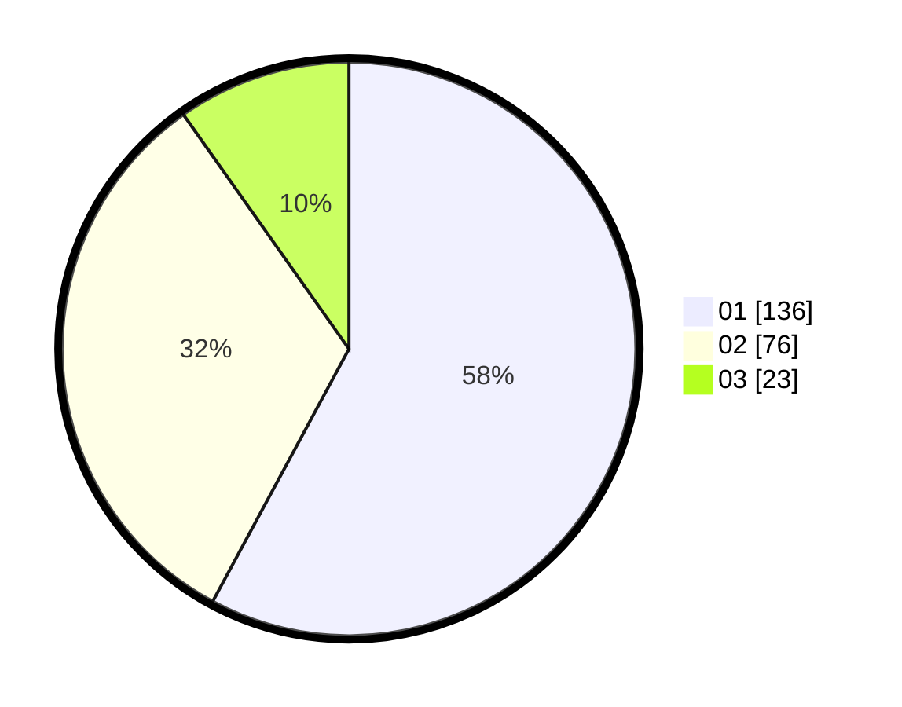

# Hasil

Hasil perolehan suara paslon dapat dilihat pada file paslon-01.txt, paslon-02.txt, dan paslon-03.txt.

Jika tidak ada, artinya data tersebut belum ada pada SIREKAP.

## Perolehan Suara

 * Paslon 01: **136**.
 * Paslon 02: **76**.
 * Paslon 03: **23**.

## Foto C Plano

https://sirekap-obj-formc.kpu.go.id/d014/pemilu/ppwp/31/74/07/10/03/3174071003040-20240218-194228--a493bd15-9075-49e9-80e7-50ea255ae8dd.jpg

https://sirekap-obj-formc.kpu.go.id/d014/pemilu/ppwp/31/74/07/10/03/3174071003040-20240218-194545--11fd482a-613b-4c66-ab68-2595a041c81a.jpg

https://sirekap-obj-formc.kpu.go.id/d014/pemilu/ppwp/31/74/07/10/03/3174071003040-20240218-195720--bf0359ff-a57a-46ce-9508-0bec8a6ea27f.jpg

## DATA PEMILIH TETAP

Jumlah pemilih dalam DPT: **280**.
 * L: **139**.
 * P: **141**.

## DATA PENGGUNA HAK PILIH

Jumlah pengguna hak pilih dalam DPT: **233**.
 * L: **112**.
 * P: **121**.

Jumlah pengguna hak pilih dalam DPTb: **2**.
 * L: **0**.
 * P: **2**.

Jumlah pengguna hak pilih dalam DPK: **0**.
 * L: **0**.
 * P: **0**.

Jumlah pengguna hak pilih: **235**.
 * L: **112**.
 * P: **123**.

## JUMLAH SUARA SAH DAN TIDAK SAH

JUMLAH SELURUH SUARA SAH: **235**.

JUMLAH SUARA TIDAK SAH: **3**.

JUMLAH SELURUH SUARA SAH DAN SUARA TIDAK SAH: **238**.
