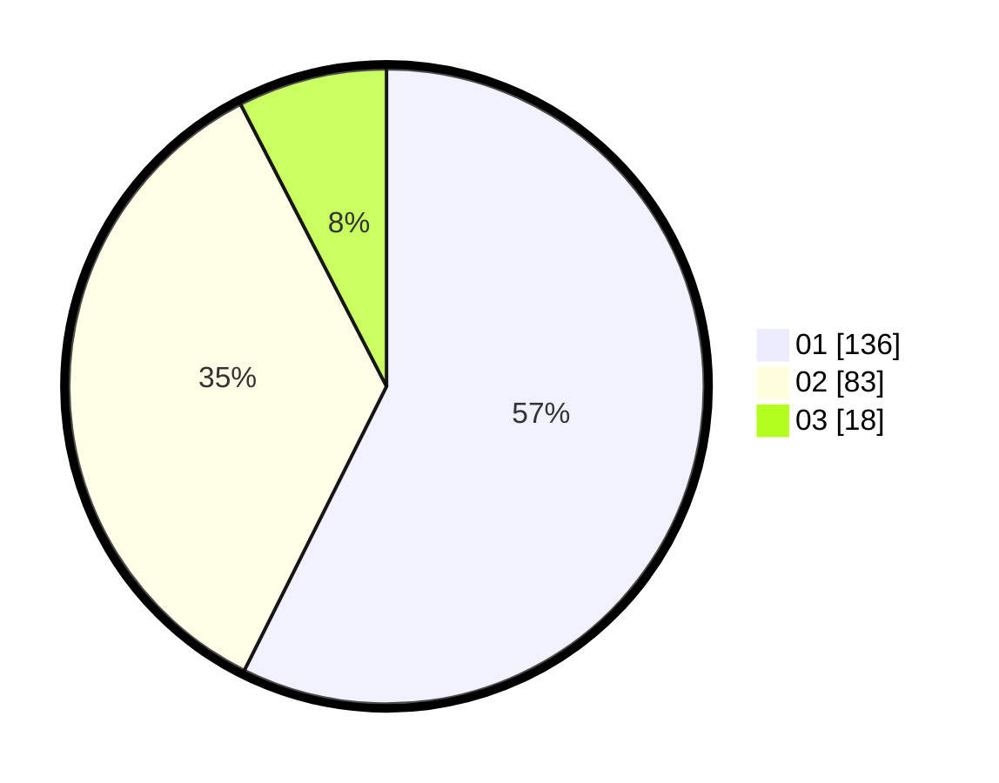

# Hasil

Hasil perolehan suara paslon dapat dilihat pada file paslon-01.txt, paslon-02.txt, dan paslon-03.txt.

Jika tidak ada, artinya data tersebut belum ada pada SIREKAP.

## Perolehan Suara

 * Paslon 01: **136**.
 * Paslon 02: **83**.
 * Paslon 03: **18**.

## Foto C Plano

https://sirekap-obj-formc.kpu.go.id/c9f8/pemilu/ppwp/31/74/07/10/03/3174071003041-20240218-213521--8b7f21cb-e8a4-4d65-a55f-2d9bd4daf304.jpg

https://sirekap-obj-formc.kpu.go.id/c9f8/pemilu/ppwp/31/74/07/10/03/3174071003041-20240218-213658--09e5e210-eb09-4988-8c19-1e4dd6c35ac4.jpg

https://sirekap-obj-formc.kpu.go.id/c9f8/pemilu/ppwp/31/74/07/10/03/3174071003041-20240218-213926--629f0891-35de-452a-a8c3-f3e2971409fd.jpg

## DATA PEMILIH TETAP

Jumlah pemilih dalam DPT: **290**.
 * L: **140**.
 * P: **150**.

## DATA PENGGUNA HAK PILIH

Jumlah pengguna hak pilih dalam DPT: **234**.
 * L: **104**.
 * P: **130**.

Jumlah pengguna hak pilih dalam DPTb: **3**.
 * L: **0**.
 * P: **3**.

Jumlah pengguna hak pilih dalam DPK: **1**.
 * L: **0**.
 * P: **1**.

Jumlah pengguna hak pilih: **238**.
 * L: **104**.
 * P: **134**.

## JUMLAH SUARA SAH DAN TIDAK SAH

JUMLAH SELURUH SUARA SAH: **237**.

JUMLAH SUARA TIDAK SAH: **1**.

JUMLAH SELURUH SUARA SAH DAN SUARA TIDAK SAH: **238**.
