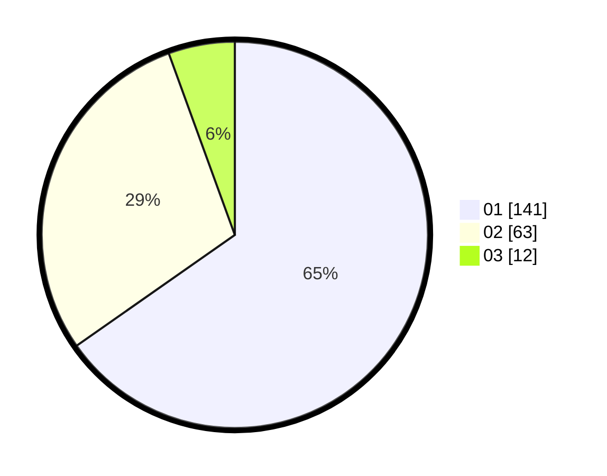

# Hasil

Hasil perolehan suara paslon dapat dilihat pada file paslon-01.txt, paslon-02.txt, dan paslon-03.txt.

Jika tidak ada, artinya data tersebut belum ada pada SIREKAP.

## Perolehan Suara

 * Paslon 01: **141**.
 * Paslon 02: **63**.
 * Paslon 03: **12**.

## Foto C Plano

https://sirekap-obj-formc.kpu.go.id/f37c/pemilu/ppwp/31/74/07/10/03/3174071003042-20240214-191425--f9b8efa1-7da6-4d3e-8cce-382247022d9e.jpg

https://sirekap-obj-formc.kpu.go.id/f37c/pemilu/ppwp/31/74/07/10/03/3174071003042-20240214-191510--50a107c7-dc1d-4765-b29c-5a75cda6ec1b.jpg

https://sirekap-obj-formc.kpu.go.id/f37c/pemilu/ppwp/31/74/07/10/03/3174071003042-20240214-192150--08778903-5a64-44e9-952d-175777079a59.jpg

## DATA PEMILIH TETAP

Jumlah pemilih dalam DPT: **268**.
 * L: **138**.
 * P: **130**.

## DATA PENGGUNA HAK PILIH

Jumlah pengguna hak pilih dalam DPT: **211**.
 * L: **101**.
 * P: **110**.

Jumlah pengguna hak pilih dalam DPTb: **3**.
 * L: **1**.
 * P: **2**.

Jumlah pengguna hak pilih dalam DPK: **6**.
 * L: **2**.
 * P: **4**.

Jumlah pengguna hak pilih: **220**.
 * L: **104**.
 * P: **116**.

## JUMLAH SUARA SAH DAN TIDAK SAH

JUMLAH SELURUH SUARA SAH: **216**.

JUMLAH SUARA TIDAK SAH: **4**.

JUMLAH SELURUH SUARA SAH DAN SUARA TIDAK SAH: **220**.
