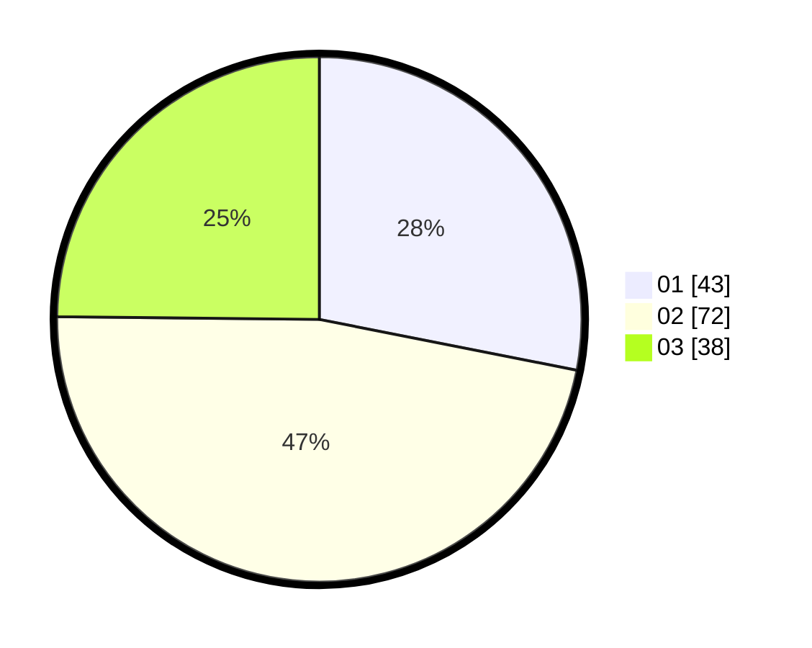

# Hasil

Hasil perolehan suara paslon dapat dilihat pada file paslon-01.txt, paslon-02.txt, dan paslon-03.txt.

Jika tidak ada, artinya data tersebut belum ada pada SIREKAP.

## Perolehan Suara

 * Paslon 01: **43**.
 * Paslon 02: **72**.
 * Paslon 03: **38**.

## Foto C Plano

https://sirekap-obj-formc.kpu.go.id/8bd0/pemilu/ppwp/31/74/07/10/03/3174071003049-20240218-210055--f485c169-7956-49dd-868c-a531a9843266.jpg

https://sirekap-obj-formc.kpu.go.id/8bd0/pemilu/ppwp/31/74/07/10/03/3174071003049-20240218-212214--0e049cf0-7e8e-47ea-9adf-7b2913c0de82.jpg

https://sirekap-obj-formc.kpu.go.id/8bd0/pemilu/ppwp/31/74/07/10/03/3174071003049-20240218-212904--937a2202-bc2f-417e-aa89-6339477accde.jpg

## DATA PEMILIH TETAP

Jumlah pemilih dalam DPT: **251**.
 * L: **137**.
 * P: **114**.

## DATA PENGGUNA HAK PILIH

Jumlah pengguna hak pilih dalam DPT: **156**.
 * L: **80**.
 * P: **76**.

Jumlah pengguna hak pilih dalam DPTb: **0**.
 * L: **0**.
 * P: **0**.

Jumlah pengguna hak pilih dalam DPK: **0**.
 * L: **0**.
 * P: **0**.

Jumlah pengguna hak pilih: **156**.
 * L: **80**.
 * P: **76**.

## JUMLAH SUARA SAH DAN TIDAK SAH

JUMLAH SELURUH SUARA SAH: **153**.

JUMLAH SUARA TIDAK SAH: **3**.

JUMLAH SELURUH SUARA SAH DAN SUARA TIDAK SAH: **156**.
