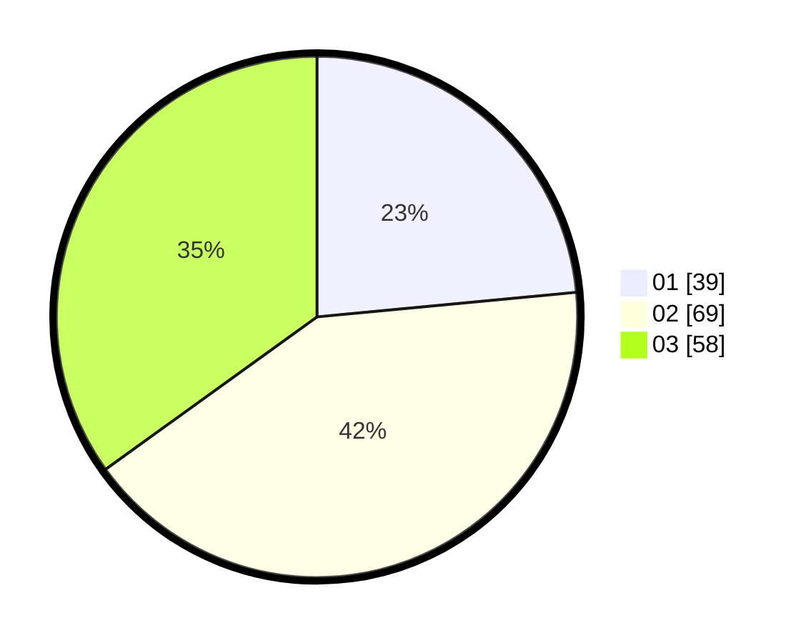

# Hasil

Hasil perolehan suara paslon dapat dilihat pada file paslon-01.txt, paslon-02.txt, dan paslon-03.txt.

Jika tidak ada, artinya data tersebut belum ada pada SIREKAP.

## Perolehan Suara

 * Paslon 01: **39**.
 * Paslon 02: **69**.
 * Paslon 03: **58**.

## Foto C Plano

https://sirekap-obj-formc.kpu.go.id/4fc7/pemilu/ppwp/31/74/07/10/04/3174071004002-20240216-203844--d273a306-181d-4ae1-9cba-ba8210f183e6.jpg

https://sirekap-obj-formc.kpu.go.id/4fc7/pemilu/ppwp/31/74/07/10/04/3174071004002-20240216-203919--7ed1c8e0-ab8d-41d3-afa9-3282e376b723.jpg

https://sirekap-obj-formc.kpu.go.id/4fc7/pemilu/ppwp/31/74/07/10/04/3174071004002-20240216-203956--16b779cc-9391-4d9c-b1d5-f35209965c32.jpg

## DATA PEMILIH TETAP

Jumlah pemilih dalam DPT: **210**.
 * L: **104**.
 * P: **106**.

## DATA PENGGUNA HAK PILIH

Jumlah pengguna hak pilih dalam DPT: **148**.
 * L: **74**.
 * P: **74**.

Jumlah pengguna hak pilih dalam DPTb: **20**.
 * L: **9**.
 * P: **11**.

Jumlah pengguna hak pilih dalam DPK: **2**.
 * L: **0**.
 * P: **2**.

Jumlah pengguna hak pilih: **170**.
 * L: **83**.
 * P: **87**.

## JUMLAH SUARA SAH DAN TIDAK SAH

JUMLAH SELURUH SUARA SAH: **166**.

JUMLAH SUARA TIDAK SAH: **2**.

JUMLAH SELURUH SUARA SAH DAN SUARA TIDAK SAH: **168**.
