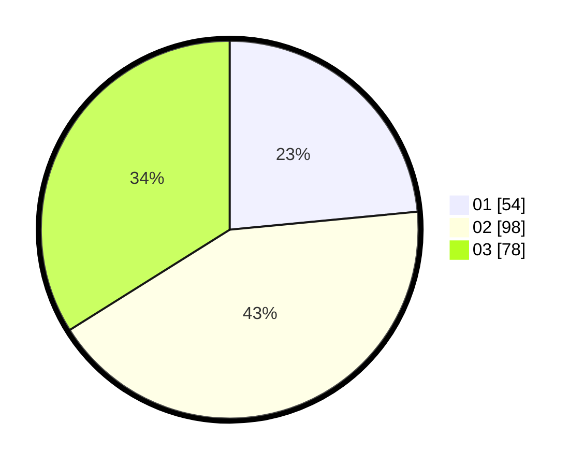

# Hasil

Hasil perolehan suara paslon dapat dilihat pada file paslon-01.txt, paslon-02.txt, dan paslon-03.txt.

Jika tidak ada, artinya data tersebut belum ada pada SIREKAP.

## Perolehan Suara

 * Paslon 01: **54**.
 * Paslon 02: **98**.
 * Paslon 03: **78**.

## Foto C Plano

https://sirekap-obj-formc.kpu.go.id/d702/pemilu/ppwp/31/74/07/10/04/3174071004005-20240218-123329--0e590ec1-e69c-4bdb-b9d4-dd8ca467675f.jpg

https://sirekap-obj-formc.kpu.go.id/d702/pemilu/ppwp/31/74/07/10/04/3174071004005-20240218-123506--cd833d15-1380-4848-9a7b-370c7a5f34ca.jpg

https://sirekap-obj-formc.kpu.go.id/d702/pemilu/ppwp/31/74/07/10/04/3174071004005-20240218-123534--9cb71c1a-f5ec-4ece-b184-1f6dc68c52b6.jpg

## DATA PEMILIH TETAP

Jumlah pemilih dalam DPT: **268**.
 * L: **124**.
 * P: **144**.

## DATA PENGGUNA HAK PILIH

Jumlah pengguna hak pilih dalam DPT: **209**.
 * L: **97**.
 * P: **112**.

Jumlah pengguna hak pilih dalam DPTb: **23**.
 * L: **11**.
 * P: **12**.

Jumlah pengguna hak pilih dalam DPK: **3**.
 * L: **0**.
 * P: **3**.

Jumlah pengguna hak pilih: **235**.
 * L: **108**.
 * P: **127**.

## JUMLAH SUARA SAH DAN TIDAK SAH

JUMLAH SELURUH SUARA SAH: **230**.

JUMLAH SUARA TIDAK SAH: **5**.

JUMLAH SELURUH SUARA SAH DAN SUARA TIDAK SAH: **235**.
