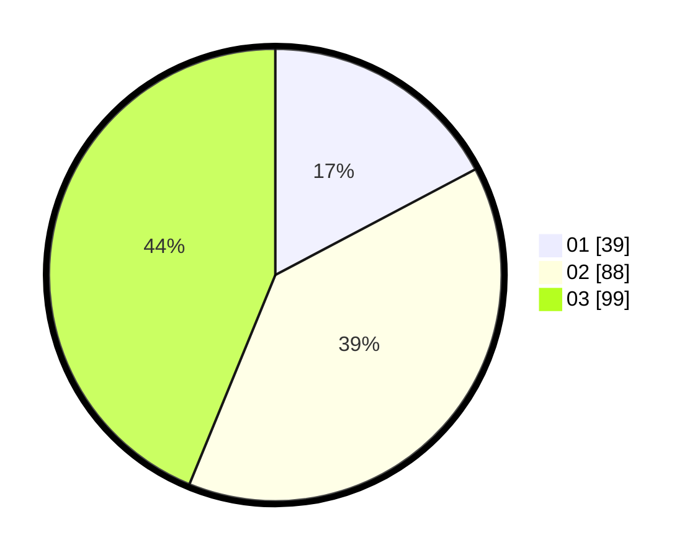

# Hasil

Hasil perolehan suara paslon dapat dilihat pada file paslon-01.txt, paslon-02.txt, dan paslon-03.txt.

Jika tidak ada, artinya data tersebut belum ada pada SIREKAP.

## Perolehan Suara

 * Paslon 01: **39**.
 * Paslon 02: **88**.
 * Paslon 03: **99**.

## Foto C Plano

https://sirekap-obj-formc.kpu.go.id/be3d/pemilu/ppwp/31/74/07/10/04/3174071004007-20240215-031349--8c08511b-f964-4932-921f-67d2b70fbb3a.jpg

https://sirekap-obj-formc.kpu.go.id/be3d/pemilu/ppwp/31/74/07/10/04/3174071004007-20240214-212537--9ccbdc2f-d934-4107-b7d6-015e41e3815d.jpg

https://sirekap-obj-formc.kpu.go.id/be3d/pemilu/ppwp/31/74/07/10/04/3174071004007-20240214-212552--40dafc21-7381-42e2-a303-d369181fafb8.jpg

## DATA PEMILIH TETAP

Jumlah pemilih dalam DPT: **281**.
 * L: **131**.
 * P: **150**.

## DATA PENGGUNA HAK PILIH

Jumlah pengguna hak pilih dalam DPT: **201**.
 * L: **93**.
 * P: **108**.

Jumlah pengguna hak pilih dalam DPTb: **22**.
 * L: **14**.
 * P: **8**.

Jumlah pengguna hak pilih dalam DPK: **7**.
 * L: **2**.
 * P: **5**.

Jumlah pengguna hak pilih: **230**.
 * L: **109**.
 * P: **121**.

## JUMLAH SUARA SAH DAN TIDAK SAH

JUMLAH SELURUH SUARA SAH: **226**.

JUMLAH SUARA TIDAK SAH: **5**.

JUMLAH SELURUH SUARA SAH DAN SUARA TIDAK SAH: **231**.
