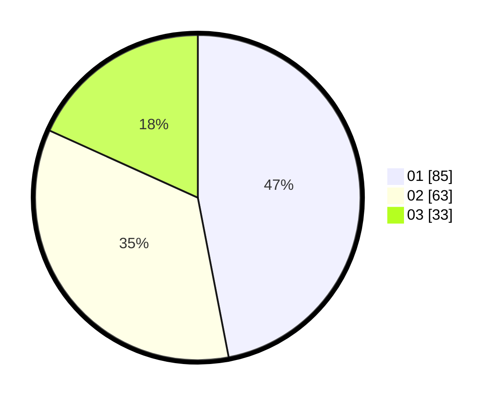

# Hasil

Hasil perolehan suara paslon dapat dilihat pada file paslon-01.txt, paslon-02.txt, dan paslon-03.txt.

Jika tidak ada, artinya data tersebut belum ada pada SIREKAP.

## Perolehan Suara

 * Paslon 01: **85**.
 * Paslon 02: **63**.
 * Paslon 03: **33**.

## Foto C Plano

https://sirekap-obj-formc.kpu.go.id/9146/pemilu/ppwp/31/74/07/10/04/3174071004009-20240218-205615--846978c4-9507-4d55-b097-dfde6ebd119a.jpg

https://sirekap-obj-formc.kpu.go.id/9146/pemilu/ppwp/31/74/07/10/04/3174071004009-20240218-210735--d488e288-aec3-4b62-a447-a48c3b2d0c23.jpg

https://sirekap-obj-formc.kpu.go.id/9146/pemilu/ppwp/31/74/07/10/04/3174071004009-20240218-210627--1764df9e-197d-44c8-b8f7-0e1276c75018.jpg

## DATA PEMILIH TETAP

Jumlah pemilih dalam DPT: **232**.
 * L: **117**.
 * P: **115**.

## DATA PENGGUNA HAK PILIH

Jumlah pengguna hak pilih dalam DPT: **166**.
 * L: **79**.
 * P: **87**.

Jumlah pengguna hak pilih dalam DPTb: **15**.
 * L: **8**.
 * P: **7**.

Jumlah pengguna hak pilih dalam DPK: **2**.
 * L: **1**.
 * P: **1**.

Jumlah pengguna hak pilih: **183**.
 * L: **88**.
 * P: **95**.

## JUMLAH SUARA SAH DAN TIDAK SAH

JUMLAH SELURUH SUARA SAH: **181**.

JUMLAH SUARA TIDAK SAH: **2**.

JUMLAH SELURUH SUARA SAH DAN SUARA TIDAK SAH: **183**.
