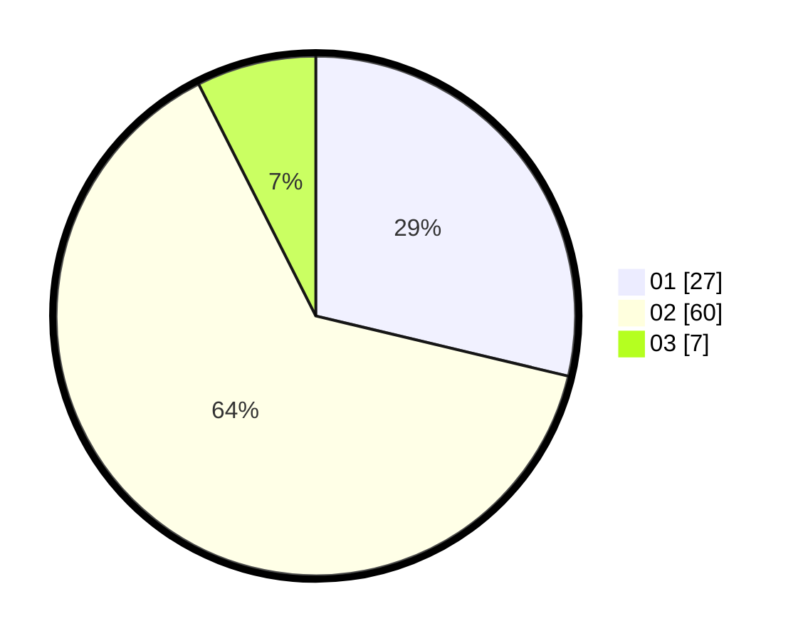

# Hasil

Hasil perolehan suara paslon dapat dilihat pada file paslon-01.txt, paslon-02.txt, dan paslon-03.txt.

Jika tidak ada, artinya data tersebut belum ada pada SIREKAP.

## Perolehan Suara

 * Paslon 01: **27**.
 * Paslon 02: **60**.
 * Paslon 03: **7**.

## Foto C Plano

https://sirekap-obj-formc.kpu.go.id/5dcc/pemilu/ppwp/31/74/07/10/04/3174071004901-20240214-205319--b67dbb3b-a0d9-46b4-9800-384393f1f618.jpg

https://sirekap-obj-formc.kpu.go.id/5dcc/pemilu/ppwp/31/74/07/10/04/3174071004901-20240214-205338--14d55c50-13b5-4774-b03c-56ab5786b65c.jpg

https://sirekap-obj-formc.kpu.go.id/5dcc/pemilu/ppwp/31/74/07/10/04/3174071004901-20240214-205346--e4840f05-37a4-421a-9317-ab1e545fd8b0.jpg

## DATA PEMILIH TETAP

Jumlah pemilih dalam DPT: **95**.
 * L: **86**.
 * P: **9**.

## DATA PENGGUNA HAK PILIH

Jumlah pengguna hak pilih dalam DPT: **0**.
 * L: **0**.
 * P: **0**.

Jumlah pengguna hak pilih dalam DPTb: **95**.
 * L: **86**.
 * P: **9**.

Jumlah pengguna hak pilih dalam DPK: **0**.
 * L: **0**.
 * P: **0**.

Jumlah pengguna hak pilih: **95**.
 * L: **86**.
 * P: **9**.

## JUMLAH SUARA SAH DAN TIDAK SAH

JUMLAH SELURUH SUARA SAH: **94**.

JUMLAH SUARA TIDAK SAH: **1**.

JUMLAH SELURUH SUARA SAH DAN SUARA TIDAK SAH: **95**.
