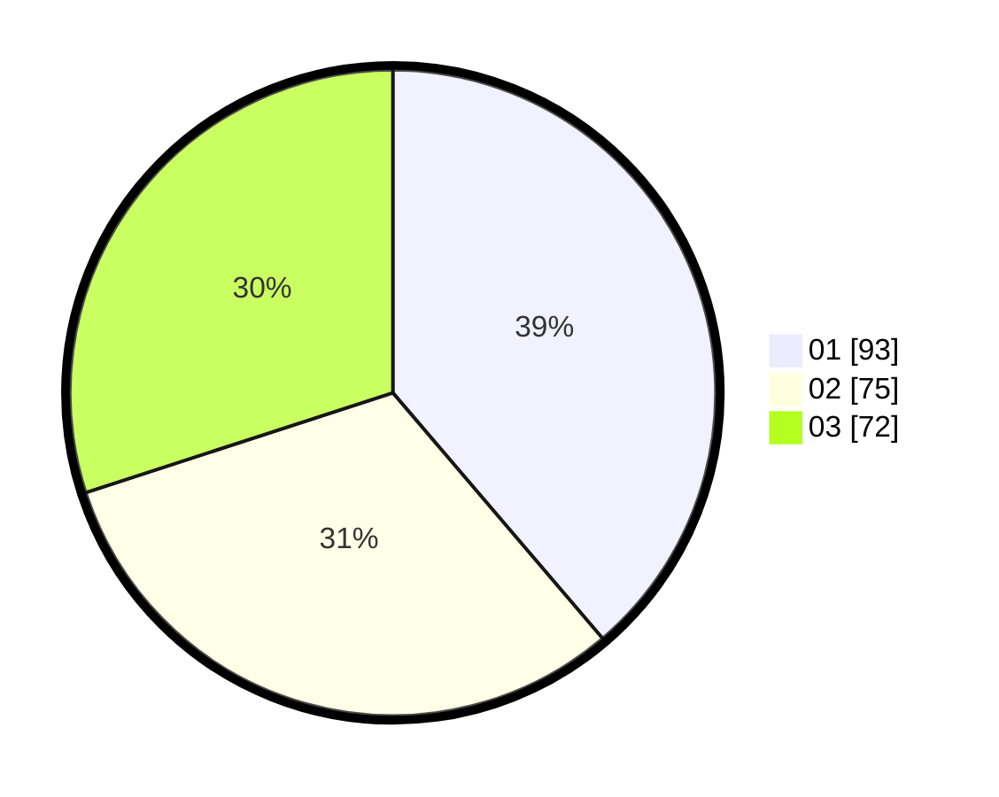

# Hasil

Hasil perolehan suara paslon dapat dilihat pada file paslon-01.txt, paslon-02.txt, dan paslon-03.txt.

Jika tidak ada, artinya data tersebut belum ada pada SIREKAP.

## Perolehan Suara

 * Paslon 01: **93**.
 * Paslon 02: **75**.
 * Paslon 03: **72**.

## Foto C Plano

https://sirekap-obj-formc.kpu.go.id/b950/pemilu/ppwp/31/74/07/10/05/3174071005002-20240218-144749--440395f4-3d3e-4fde-bcb8-fd1ea0976def.jpg

https://sirekap-obj-formc.kpu.go.id/b950/pemilu/ppwp/31/74/07/10/05/3174071005002-20240218-145605--ffb728f5-9ce3-44f8-8a50-ebeeff78bc14.jpg

https://sirekap-obj-formc.kpu.go.id/b950/pemilu/ppwp/31/74/07/10/05/3174071005002-20240218-144947--8714fd81-975a-49ee-a4e1-8dfe21e82258.jpg

## DATA PEMILIH TETAP

Jumlah pemilih dalam DPT: **277**.
 * L: **143**.
 * P: **134**.

## DATA PENGGUNA HAK PILIH

Jumlah pengguna hak pilih dalam DPT: **225**.
 * L: **112**.
 * P: **113**.

Jumlah pengguna hak pilih dalam DPTb: **20**.
 * L: **9**.
 * P: **11**.

Jumlah pengguna hak pilih dalam DPK: **5**.
 * L: **4**.
 * P: **1**.

Jumlah pengguna hak pilih: **250**.
 * L: **125**.
 * P: **125**.

## JUMLAH SUARA SAH DAN TIDAK SAH

JUMLAH SELURUH SUARA SAH: **240**.

JUMLAH SUARA TIDAK SAH: **10**.

JUMLAH SELURUH SUARA SAH DAN SUARA TIDAK SAH: **250**.
