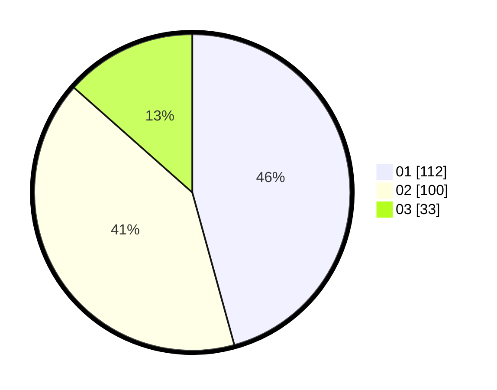

# Hasil

Hasil perolehan suara paslon dapat dilihat pada file paslon-01.txt, paslon-02.txt, dan paslon-03.txt.

Jika tidak ada, artinya data tersebut belum ada pada SIREKAP.

## Perolehan Suara

 * Paslon 01: **112**.
 * Paslon 02: **100**.
 * Paslon 03: **33**.

## Foto C Plano

https://sirekap-obj-formc.kpu.go.id/33fe/pemilu/ppwp/31/74/07/10/05/3174071005003-20240219-102956--8ef26dce-cc8a-4b00-a762-d6a05f7db924.jpg

https://sirekap-obj-formc.kpu.go.id/33fe/pemilu/ppwp/31/74/07/10/05/3174071005003-20240219-103054--5b6f3806-d6db-4d6f-a0cb-cfc36ac970b5.jpg

https://sirekap-obj-formc.kpu.go.id/33fe/pemilu/ppwp/31/74/07/10/05/3174071005003-20240219-103134--915d4d51-57ca-4367-b01e-16e4cc1142a2.jpg

## DATA PEMILIH TETAP

Jumlah pemilih dalam DPT: **276**.
 * L: **144**.
 * P: **132**.

## DATA PENGGUNA HAK PILIH

Jumlah pengguna hak pilih dalam DPT: **241**.
 * L: **125**.
 * P: **116**.

Jumlah pengguna hak pilih dalam DPTb: **18**.
 * L: **3**.
 * P: **15**.

Jumlah pengguna hak pilih dalam DPK: **0**.
 * L: **0**.
 * P: **0**.

Jumlah pengguna hak pilih: **259**.
 * L: **128**.
 * P: **131**.

## JUMLAH SUARA SAH DAN TIDAK SAH

JUMLAH SELURUH SUARA SAH: **245**.

JUMLAH SUARA TIDAK SAH: **14**.

JUMLAH SELURUH SUARA SAH DAN SUARA TIDAK SAH: **259**.
