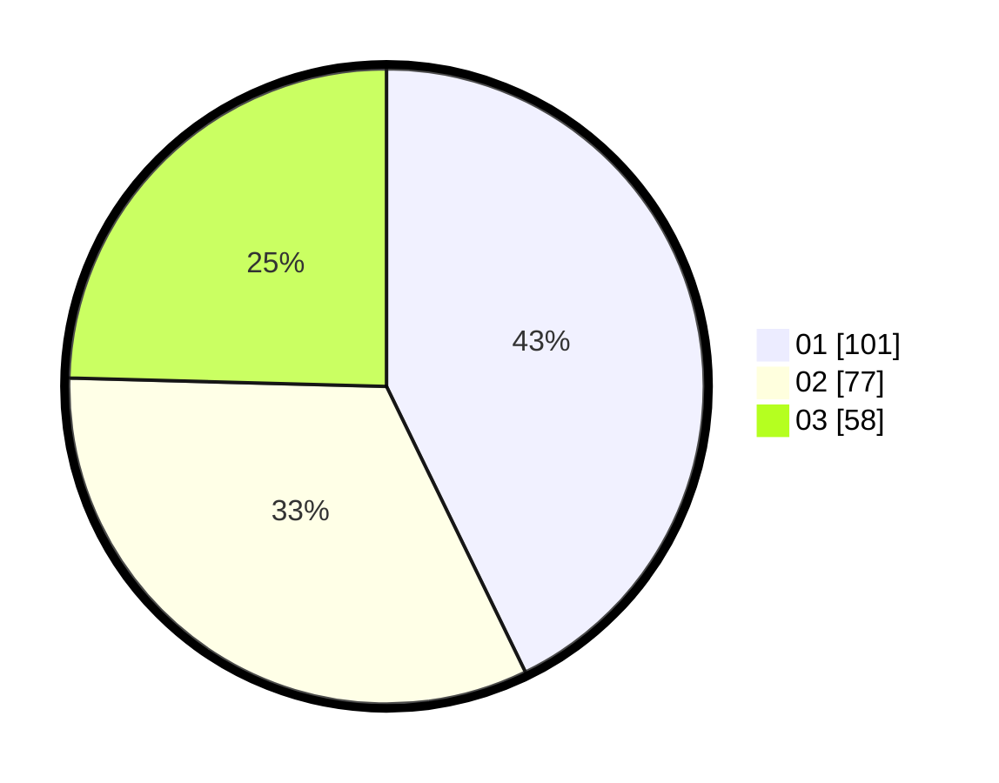

# Hasil

Hasil perolehan suara paslon dapat dilihat pada file paslon-01.txt, paslon-02.txt, dan paslon-03.txt.

Jika tidak ada, artinya data tersebut belum ada pada SIREKAP.

## Perolehan Suara

 * Paslon 01: **101**.
 * Paslon 02: **77**.
 * Paslon 03: **58**.

## Foto C Plano

https://sirekap-obj-formc.kpu.go.id/1106/pemilu/ppwp/31/74/07/10/05/3174071005016-20240214-193530--d44f7246-8d51-45f0-852c-969a3ce90074.jpg

https://sirekap-obj-formc.kpu.go.id/1106/pemilu/ppwp/31/74/07/10/05/3174071005016-20240214-203859--6f86a38d-30ea-48d2-a7a4-c372ed57ca01.jpg

https://sirekap-obj-formc.kpu.go.id/1106/pemilu/ppwp/31/74/07/10/05/3174071005016-20240214-193801--2b2e384b-0828-401e-ba6b-9af173f6b964.jpg

## DATA PEMILIH TETAP

Jumlah pemilih dalam DPT: **271**.
 * L: **124**.
 * P: **147**.

## DATA PENGGUNA HAK PILIH

Jumlah pengguna hak pilih dalam DPT: **220**.
 * L: **95**.
 * P: **125**.

Jumlah pengguna hak pilih dalam DPTb: **19**.
 * L: **4**.
 * P: **15**.

Jumlah pengguna hak pilih dalam DPK: **0**.
 * L: **0**.
 * P: **0**.

Jumlah pengguna hak pilih: **239**.
 * L: **99**.
 * P: **140**.

## JUMLAH SUARA SAH DAN TIDAK SAH

JUMLAH SELURUH SUARA SAH: **236**.

JUMLAH SUARA TIDAK SAH: **3**.

JUMLAH SELURUH SUARA SAH DAN SUARA TIDAK SAH: **239**.
