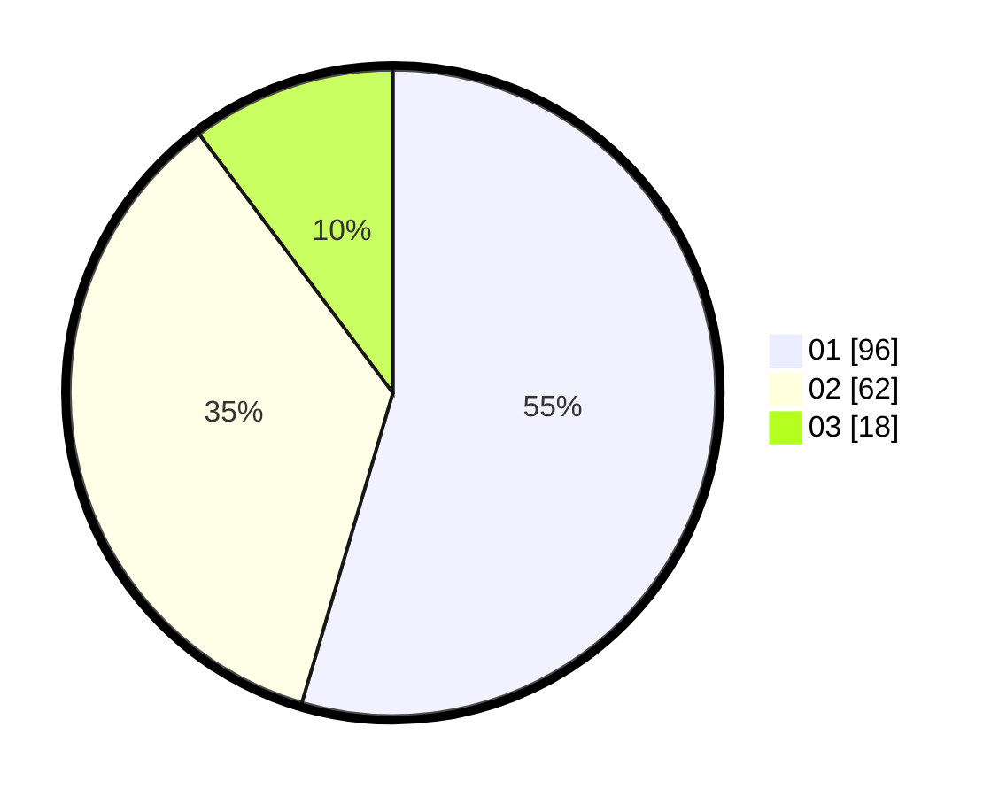

# Hasil

Hasil perolehan suara paslon dapat dilihat pada file paslon-01.txt, paslon-02.txt, dan paslon-03.txt.

Jika tidak ada, artinya data tersebut belum ada pada SIREKAP.

## Perolehan Suara

 * Paslon 01: **96**.
 * Paslon 02: **62**.
 * Paslon 03: **18**.

## Foto C Plano

https://sirekap-obj-formc.kpu.go.id/42e9/pemilu/ppwp/31/74/07/10/06/3174071006006-20240214-190158--eb684adf-074f-4f74-94c1-d23e3f8dca3c.jpg

https://sirekap-obj-formc.kpu.go.id/42e9/pemilu/ppwp/31/74/07/10/06/3174071006006-20240214-190231--8082e9b6-6dee-49d2-aec4-ac6eed1c3ae7.jpg

https://sirekap-obj-formc.kpu.go.id/42e9/pemilu/ppwp/31/74/07/10/06/3174071006006-20240214-190311--6c001d93-6e39-403b-bcad-6b6b6c777eec.jpg

## DATA PEMILIH TETAP

Jumlah pemilih dalam DPT: **127**.
 * L: **57**.
 * P: **70**.

## DATA PENGGUNA HAK PILIH

Jumlah pengguna hak pilih dalam DPT: **127**.
 * L: **57**.
 * P: **70**.

Jumlah pengguna hak pilih dalam DPTb: **51**.
 * L: **18**.
 * P: **33**.

Jumlah pengguna hak pilih dalam DPK: **1**.
 * L: **1**.
 * P: **0**.

Jumlah pengguna hak pilih: **179**.
 * L: **76**.
 * P: **103**.

## JUMLAH SUARA SAH DAN TIDAK SAH

JUMLAH SELURUH SUARA SAH: **176**.

JUMLAH SUARA TIDAK SAH: **3**.

JUMLAH SELURUH SUARA SAH DAN SUARA TIDAK SAH: **179**.
