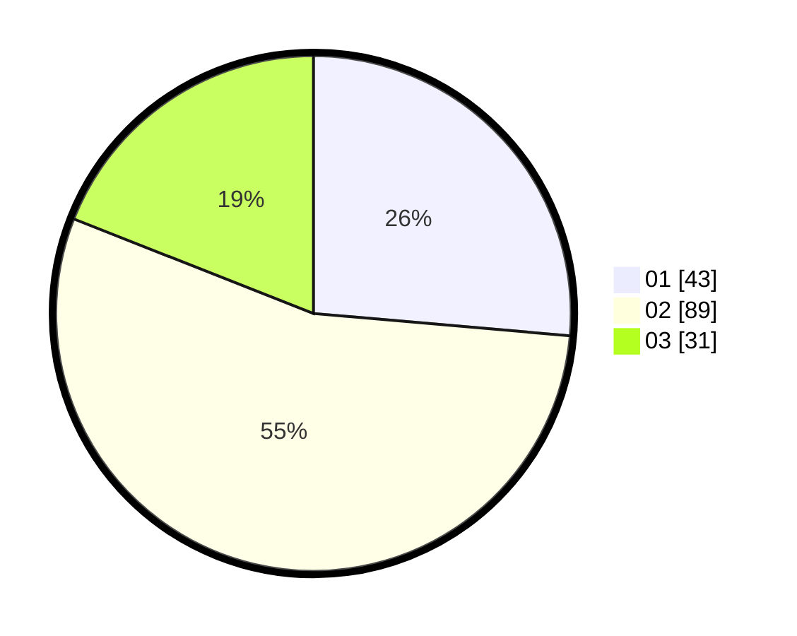

# Hasil

Hasil perolehan suara paslon dapat dilihat pada file paslon-01.txt, paslon-02.txt, dan paslon-03.txt.

Jika tidak ada, artinya data tersebut belum ada pada SIREKAP.

## Perolehan Suara

 * Paslon 01: **43**.
 * Paslon 02: **89**.
 * Paslon 03: **31**.

## Foto C Plano

https://sirekap-obj-formc.kpu.go.id/2f2b/pemilu/ppwp/31/74/07/10/06/3174071006009-20240214-195136--f801d840-ff9a-4f25-876d-bab4e3daaffe.jpg

https://sirekap-obj-formc.kpu.go.id/2f2b/pemilu/ppwp/31/74/07/10/06/3174071006009-20240214-203339--7118cb93-98a3-463c-8fd0-c96f47822c6c.jpg

https://sirekap-obj-formc.kpu.go.id/2f2b/pemilu/ppwp/31/74/07/10/06/3174071006009-20240214-200447--bd2cc38f-b956-4b60-9e2c-43e17a4483d5.jpg
