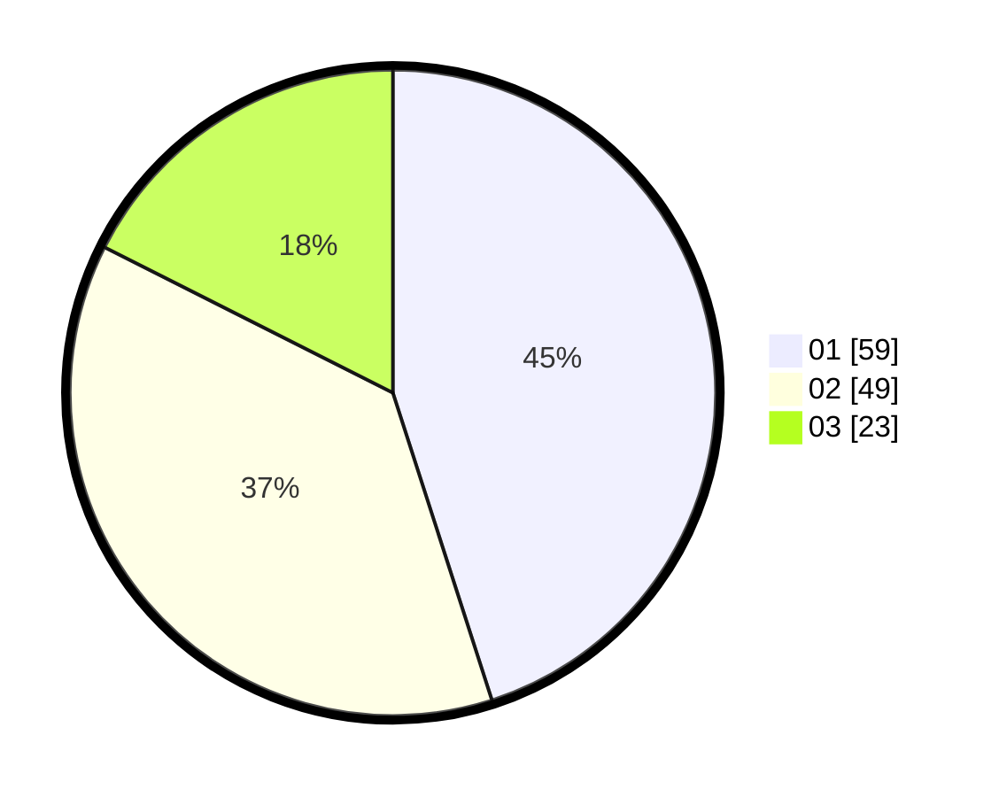

# Hasil

Hasil perolehan suara paslon dapat dilihat pada file paslon-01.txt, paslon-02.txt, dan paslon-03.txt.

Jika tidak ada, artinya data tersebut belum ada pada SIREKAP.

## Perolehan Suara

 * Paslon 01: **59**.
 * Paslon 02: **49**.
 * Paslon 03: **23**.

## Foto C Plano

https://sirekap-obj-formc.kpu.go.id/6475/pemilu/ppwp/31/74/07/10/06/3174071006010-20240214-200638--6cbcdb8d-7a8f-4541-b9dc-d17208e9a6d7.jpg

https://sirekap-obj-formc.kpu.go.id/6475/pemilu/ppwp/31/74/07/10/06/3174071006010-20240214-195707--1498ba01-979e-4b5f-814c-238fb9d2840e.jpg

https://sirekap-obj-formc.kpu.go.id/6475/pemilu/ppwp/31/74/07/10/06/3174071006010-20240214-200229--71785e46-3222-4ca1-9a8d-28a769b5158a.jpg

## DATA PEMILIH TETAP

Jumlah pemilih dalam DPT: **193**.
 * L: **96**.
 * P: **97**.

## DATA PENGGUNA HAK PILIH

Jumlah pengguna hak pilih dalam DPT: **108**.
 * L: **50**.
 * P: **58**.

Jumlah pengguna hak pilih dalam DPTb: **21**.
 * L: **17**.
 * P: **4**.

Jumlah pengguna hak pilih dalam DPK: **2**.
 * L: **2**.
 * P: **0**.

Jumlah pengguna hak pilih: **131**.
 * L: **69**.
 * P: **62**.

## JUMLAH SUARA SAH DAN TIDAK SAH

JUMLAH SELURUH SUARA SAH: **131**.

JUMLAH SUARA TIDAK SAH: **0**.

JUMLAH SELURUH SUARA SAH DAN SUARA TIDAK SAH: **131**.
