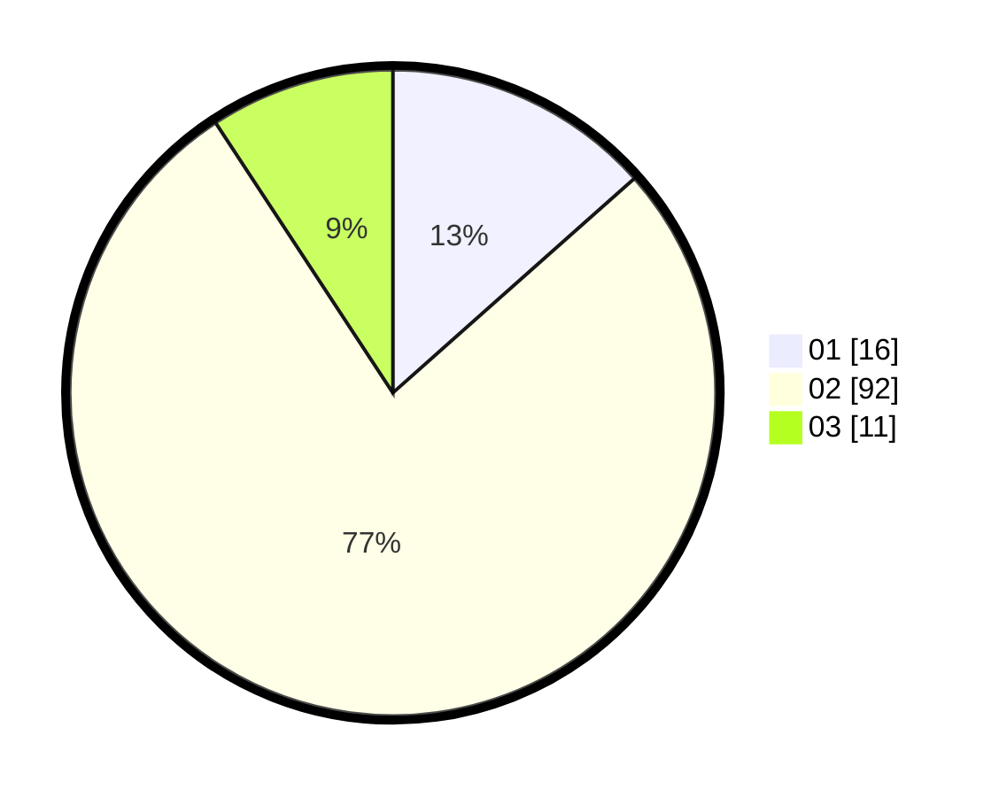

# Hasil

Hasil perolehan suara paslon dapat dilihat pada file paslon-01.txt, paslon-02.txt, dan paslon-03.txt.

Jika tidak ada, artinya data tersebut belum ada pada SIREKAP.

## Perolehan Suara

 * Paslon 01: **16**.
 * Paslon 02: **92**.
 * Paslon 03: **11**.

## Foto C Plano

https://sirekap-obj-formc.kpu.go.id/fb86/pemilu/ppwp/31/74/07/10/06/3174071006901-20240214-192436--120fe002-984e-4d44-8416-8b7f6a555df7.jpg

https://sirekap-obj-formc.kpu.go.id/fb86/pemilu/ppwp/31/74/07/10/06/3174071006901-20240214-192516--cf66ab62-b017-4878-b264-d5d74f63618f.jpg

https://sirekap-obj-formc.kpu.go.id/fb86/pemilu/ppwp/31/74/07/10/06/3174071006901-20240214-192538--fa6a42ae-786c-4f59-bf2d-c83321194363.jpg

## DATA PEMILIH TETAP

Jumlah pemilih dalam DPT: **123**.
 * L: **108**.
 * P: **15**.

## DATA PENGGUNA HAK PILIH

Jumlah pengguna hak pilih dalam DPT: **0**.
 * L: **0**.
 * P: **0**.

Jumlah pengguna hak pilih dalam DPTb: **123**.
 * L: **108**.
 * P: **15**.

Jumlah pengguna hak pilih dalam DPK: **0**.
 * L: **0**.
 * P: **0**.

Jumlah pengguna hak pilih: **123**.
 * L: **108**.
 * P: **15**.

## JUMLAH SUARA SAH DAN TIDAK SAH

JUMLAH SELURUH SUARA SAH: **119**.

JUMLAH SUARA TIDAK SAH: **4**.

JUMLAH SELURUH SUARA SAH DAN SUARA TIDAK SAH: **123**.
