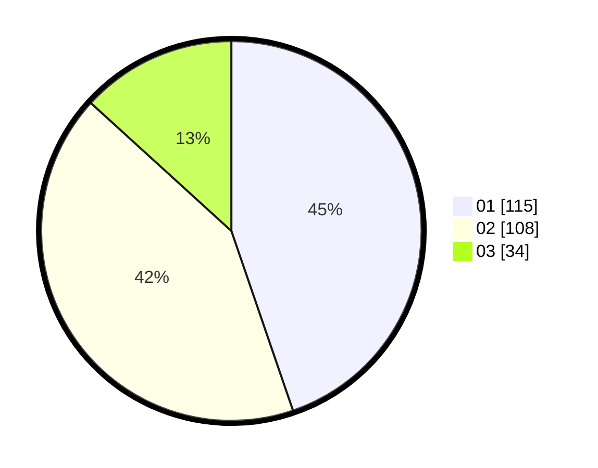

# Hasil

Hasil perolehan suara paslon dapat dilihat pada file paslon-01.txt, paslon-02.txt, dan paslon-03.txt.

Jika tidak ada, artinya data tersebut belum ada pada SIREKAP.

## Perolehan Suara

 * Paslon 01: **115**.
 * Paslon 02: **108**.
 * Paslon 03: **34**.

## Foto C Plano

https://sirekap-obj-formc.kpu.go.id/e4af/pemilu/ppwp/31/74/07/10/07/3174071007015-20240214-192550--027e055b-77d6-4b51-b8eb-bcf701b1090c.jpg

https://sirekap-obj-formc.kpu.go.id/e4af/pemilu/ppwp/31/74/07/10/07/3174071007015-20240214-192637--6bf61473-6a8d-4b3b-a031-20f7de13b81c.jpg

https://sirekap-obj-formc.kpu.go.id/e4af/pemilu/ppwp/31/74/07/10/07/3174071007015-20240214-192654--76766a92-493f-4842-a640-4bcb161df45f.jpg

## DATA PEMILIH TETAP

Jumlah pemilih dalam DPT: **297**.
 * L: **142**.
 * P: **155**.

## DATA PENGGUNA HAK PILIH

Jumlah pengguna hak pilih dalam DPT: **243**.
 * L: **115**.
 * P: **128**.

Jumlah pengguna hak pilih dalam DPTb: **19**.
 * L: **13**.
 * P: **6**.

Jumlah pengguna hak pilih dalam DPK: **0**.
 * L: **0**.
 * P: **0**.

Jumlah pengguna hak pilih: **262**.
 * L: **128**.
 * P: **134**.

## JUMLAH SUARA SAH DAN TIDAK SAH

JUMLAH SELURUH SUARA SAH: **257**.

JUMLAH SUARA TIDAK SAH: **5**.

JUMLAH SELURUH SUARA SAH DAN SUARA TIDAK SAH: **262**.
