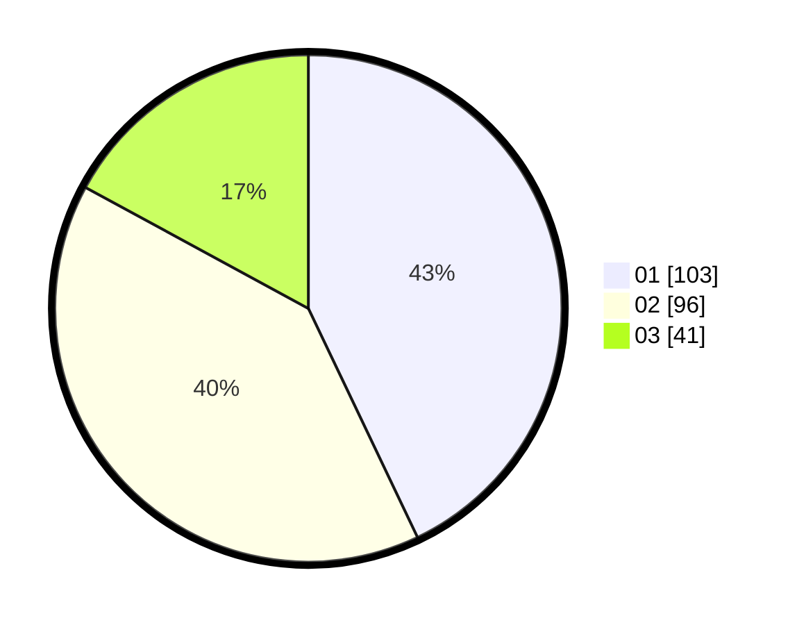

# Hasil

Hasil perolehan suara paslon dapat dilihat pada file paslon-01.txt, paslon-02.txt, dan paslon-03.txt.

Jika tidak ada, artinya data tersebut belum ada pada SIREKAP.

## Perolehan Suara

 * Paslon 01: **103**.
 * Paslon 02: **96**.
 * Paslon 03: **41**.

## Foto C Plano

https://sirekap-obj-formc.kpu.go.id/ab40/pemilu/ppwp/31/74/07/10/09/3174071009004-20240216-194512--14b5f053-d316-4a3e-ad5c-882168a6a6cd.jpg

https://sirekap-obj-formc.kpu.go.id/ab40/pemilu/ppwp/31/74/07/10/09/3174071009004-20240216-194555--f485e40d-c23c-4363-af04-5793f632ecb3.jpg

https://sirekap-obj-formc.kpu.go.id/ab40/pemilu/ppwp/31/74/07/10/09/3174071009004-20240216-194821--a475321c-56a3-4f8b-9885-8c2e9eb80174.jpg

## DATA PEMILIH TETAP

Jumlah pemilih dalam DPT: **268**.
 * L: **529**.
 * P: **339**.

## DATA PENGGUNA HAK PILIH

Jumlah pengguna hak pilih dalam DPT: **258**.
 * L: **4**.
 * P: **564**.

Jumlah pengguna hak pilih dalam DPTb: **20**.
 * L: **288**.
 * P: **589**.

Jumlah pengguna hak pilih dalam DPK: **803**.
 * L: **882**.
 * P: **54**.

Jumlah pengguna hak pilih: **241**.
 * L: **587**.
 * P: **524**.

## JUMLAH SUARA SAH DAN TIDAK SAH

JUMLAH SELURUH SUARA SAH: **240**.

JUMLAH SUARA TIDAK SAH: **1**.

JUMLAH SELURUH SUARA SAH DAN SUARA TIDAK SAH: **241**.
