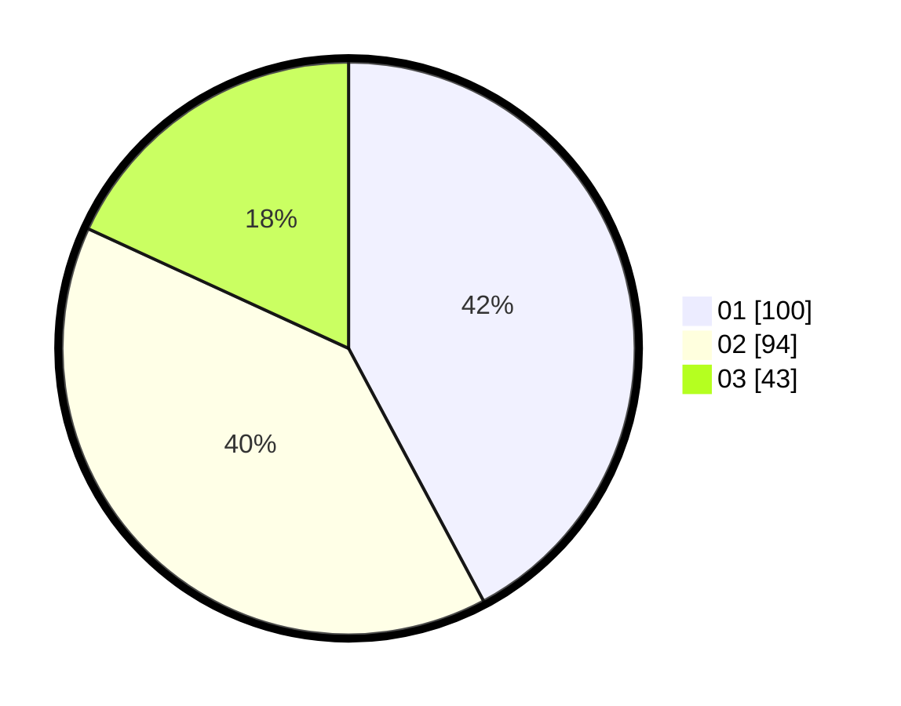

# Hasil

Hasil perolehan suara paslon dapat dilihat pada file paslon-01.txt, paslon-02.txt, dan paslon-03.txt.

Jika tidak ada, artinya data tersebut belum ada pada SIREKAP.

## Perolehan Suara

 * Paslon 01: **100**.
 * Paslon 02: **94**.
 * Paslon 03: **43**.

## Foto C Plano

https://sirekap-obj-formc.kpu.go.id/f957/pemilu/ppwp/31/74/07/10/09/3174071009005-20240217-095933--18f67b90-507c-48ba-a6e9-0feb58041147.jpg

https://sirekap-obj-formc.kpu.go.id/f957/pemilu/ppwp/31/74/07/10/09/3174071009005-20240217-100019--df5cbf4b-4438-4e85-9ec0-440f91415a09.jpg

https://sirekap-obj-formc.kpu.go.id/f957/pemilu/ppwp/31/74/07/10/09/3174071009005-20240217-100046--d4b00596-db46-4172-8bfa-f522a74dd281.jpg

## DATA PEMILIH TETAP

Jumlah pemilih dalam DPT: **268**.
 * L: **555**.
 * P: **37**.

## DATA PENGGUNA HAK PILIH

Jumlah pengguna hak pilih dalam DPT: **555**.
 * L: **333**.
 * P: **555**.

Jumlah pengguna hak pilih dalam DPTb: **555**.
 * L: **355**.
 * P: **555**.

Jumlah pengguna hak pilih dalam DPK: **555**.
 * L: **555**.
 * P: **555**.

Jumlah pengguna hak pilih: **555**.
 * L: **605**.
 * P: **455**.

## JUMLAH SUARA SAH DAN TIDAK SAH

JUMLAH SELURUH SUARA SAH: **237**.

JUMLAH SUARA TIDAK SAH: **1**.

JUMLAH SELURUH SUARA SAH DAN SUARA TIDAK SAH: **238**.
